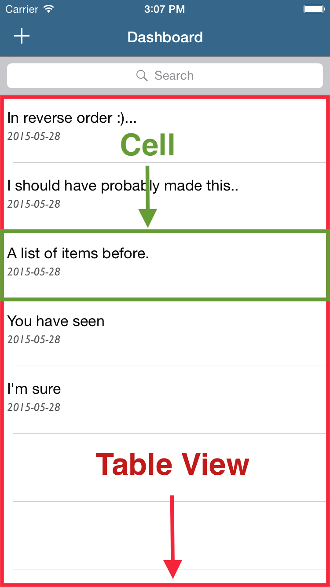

## Introducing Tables Views

Table views are UI elements provided by the *UIKit Framework* that can display lists of information, where each piece of information is displayed in one cell.

We can think of table views as regular views that have been given extra functionality, namely the ability to display and vertically scroll through content.

#### *When should we use table views?*

We should use table views to display lists of information. If we were creating a photo sharing app, like **Makestagram**, we could use a table view to display a list of friends whom we may choose to follow. If we were creating a notes app, like **MakeSchoolNotes**, we could use a table view to display all of the user’s notes.

#### *Why use table views?*

The primary reason for using table views is that they provide a lot of great functionality without a lot of setup. Using a table view, we can easily scroll through many cells and make our cells selectable, meaning we can make something happen when a user touches a specific cell.

#### *How do we create table views?*

We create table views by creating new instances of the `UITableView` class. We can create new table views programmatically or in Interface Builder, oftentimes we will choose the latter option as it is easier to set everything up. The `UITableView` class has many properties and methods which we can use to manipulate how the table view behaves. The most important properties of a table view are its `dataSource` and `delegate`: The `dataSource` allows us to specify what information a table view should display. The `delegate` allows us to specify how we can interact with the table view, like whether a specific cell can be selected.

If you are curious about the properties and methods available to an instance of the `UITableView` class, take a look at Apple's [documentation](https://developer.apple.com/library/ios/documentation/UIKit/Reference/UITableView_Class/).

#### *How do we setup table views?*

Table views have two components: the *functionality* and the *information*. The functionality (vertical scrolling and the ability to select cells) is provided for free by the table view. To inform our table view about which information to display, we must do some setup.

When displaying information, a table view *must* know two things:

1. Total number of cells
2. What information to display for each specific cell

To pass along this information to a table view, we use the table view’s `dataSource` property. The `dataSource` property is a special type of property called a **delegate**. For more information on *delegates* checkout this [quick discussion-BROKEN LINK](link to delegate discussion).
