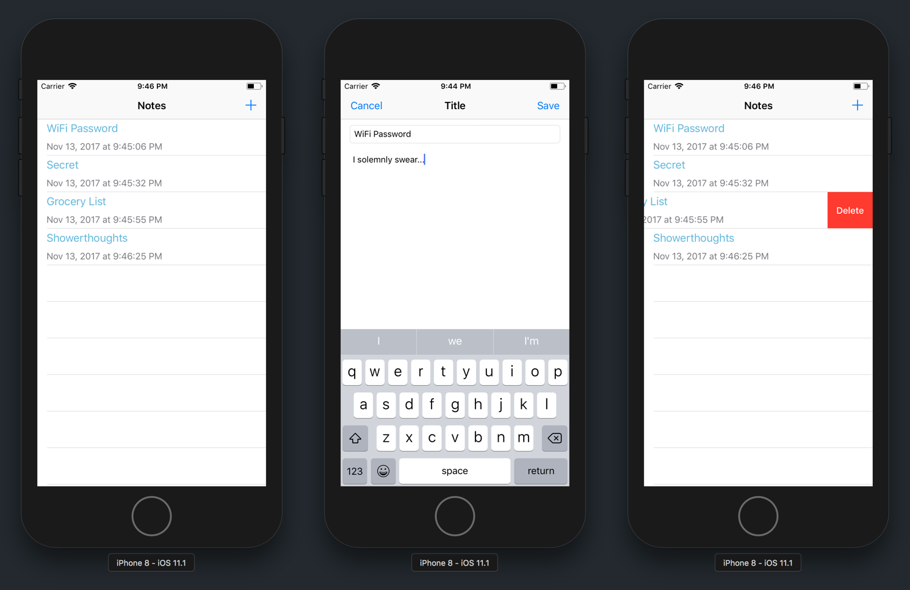

This is the third tutorial of Make School's iOS app tutorial series.

In this tutorial, we'll focus on navigation and data persistence. First, we'll learn to use navigation controllers and segues to navigate between multiple view controllers. Additionally, we'll get started with _Core Data_ and saving data to our devices. Throughout the process, we'll build a notes app!

"Are you ready for it?" - Taylor Swift

# Who Is This For?

iOS beginners who already have some experience with Xcode and building simple apps.

## What You Should Already Know

This tutorial builds on key concepts from the first two Make School tutorials.

You should know how to:

- navigate your way around Xcode
- create `IBOutlet` and `IBAction` connections (on your own)
- be familiar with _Auto-Layout_

If you're struggling with the concepts above, it's recommended to first complete the previous Make School tutorials.

## Estimated Completion Time:

4 hours

# What We're Building

At the end of this tutorial, you'll have built your own _Notes_ app!

If you've been searching for an app to record all those ideas you've come up with in the shower, this one's for you! (But please first make sure your iPhone device is waterproof.)

Your notes app will be able to:

1. Create, edit and delete notes.
1. Give each note a title and body.
1. Save notes between app launches (data persistence.)
1. View a scrollable list of existing notes.

# What You'll Learn

By the end of this tutorial, you will:

- learn to use `UITableView` and `UITableViewCell` to create scrollable views
- use `UINavigationController` and segues to navigate between multiple view controllers
- how to pass data between different view controllers
- persist data between app launches using _Core Data_

> [info]
*Persisting data* is a fancy way of saying "saving data to your device". Normally, if you close your app, all your data is deleted. By using _Core Data_, we can save and retrieve our app's data between each app launch.

# Starter Project

<!-- TODO: Needs to be updated to Swift4 -->

When you're ready, download the [start project](https://github.com/MakeSchool-Tutorials/MakeSchoolNotes-Swift-V2-Starter/archive/swift4-coredata.zip) and move onto the next section!

# If You Get Stuck

Getting stuck when coding (and debugging) is a natural part of the programming process. If you find yourself stuck on a problem or lost, pause for a moment and take a breath. Maybe take a walk. Then retrace your steps (in the tutorial, not the walk.) Make sure you've follow each step of the tutorial. It's easy to make typos or to accidentally skip over important steps.

<!-- TODO: insert link to github repo "If you want to compare your code to the solution, you can find it here." -->
