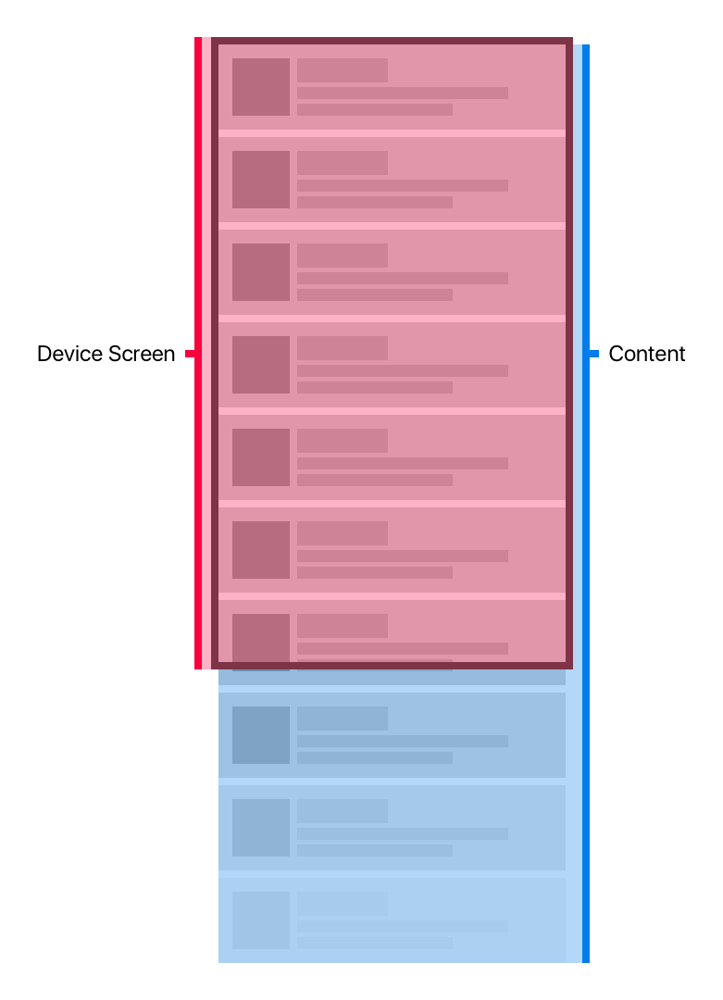
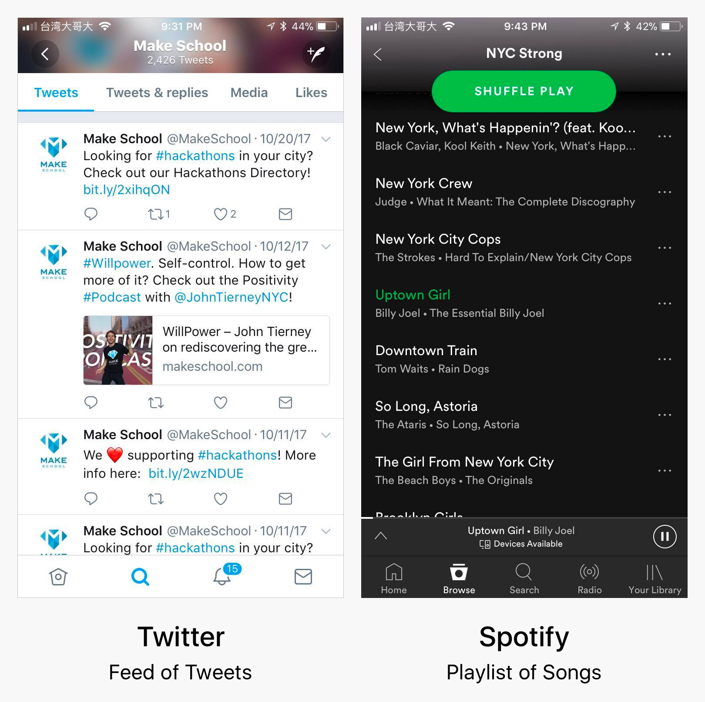
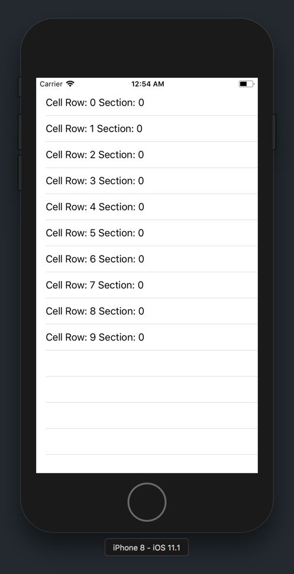

In the apps we've built so far, we've learned how to build UI layouts using `UIKit` objects and _Auto-Layout_. But what if all of the content can't fit onto our device's screen at the same time?



As in the example above, this is especially common for UI layouts involving feeds or lists of content.



Twitter uses this layout to a vertically scrollable feed of tweets. Likewise, Spotify uses the same UI layout to display a playlist of songs.

To create this UI layout, we'll introduce a new `UIKit` object: `UITableView`. Table views provide a way for us to easily build vertical and horizontal scrolling content.

A `UITableView` uses one or more `UITableViewCell` objects to create a scrollable list of cells. In most basic cases, each cell represents one item. For example, in our Twitter example, each tweet, or row, is a `UITableViewCell`.


On the left, we have the _frame_ of our `UITableView`. Within the table view, we can see that each tweet, or row, is made up of a `UITableViewCell`.

> [info]
The `UITableView` class has a lot of depth. You can customize your table view to have headers, footers, multiple sections, etc. For the scope of this tutorial, we'll be covering the fundamentals. For more information on table views, check out this [explanation.](https://www.makeschool.com/tutorials/swift-concepts-explained/table-views)

Next, let's look at how to create our own `UITableView`.

# Using an UITableViewController

In our Notes app, we'll be using a subclass of `UIViewController` called `UITableViewController`. As the name might suggest, a `UITableViewController` is a `UIViewController` with a `UITableView` on it.

Our starter project already contains our table view controller. Let's open it now.

> [action]
Open your `Main.storyboard`, using your _Project Navigator_. 

Using `UITableViewController` are great for simple lists of content because they abstract a lot of boilerplate code that you'd usually need to implement a table view in a view controller.

Next, we need to pair our storyboard table view controller with it's Swift source file. If you recall from our previous tutorials, we can do this by setting our storyboard table view controller's custom class. Let's connect our storyboard's table view controller with our `ListNotesTableViewController` that's already included in our project.

> [action]
Open `Main.storyboard` and set the custom class of the `UITableViewController`:
>
1. Select your storyboard table view controller by selecting it in _Interface Builder_ or in the _Document Outline_.
1. Open the _Identity Inspector_ in the _Utilities area_.
1. In the _Custom Class_ section, set the _Class_ attribute to `ListNotesTableViewController`. Auto-complete should help you select the correct class.
>


Now that we've set our custom subclass of our storyboard table view controller to `ListNotesTableViewController`, we've paired our storyboard table view controller with our Swift code. Let's begin adding code to `ListNotesTableViewController.swift` file.

# Displaying Table View Cells

With our `UITableViewController` subclass set, let's look at how to display a simple, unstyled table view cell.

First, open your table view controller's source file.

> [action]
Open `ListNotesTableViewController.swift` in the _Controller_ group with your _Project Navigator_. 

Even though our `ListNotesTableViewController` class is currently empty, this is where our table view controller related code will go.

## Implementing Data Source Methods

Hidden within the `UITableViewController` abstraction, are it's `UITableViewDataSource` methods. These methods provide the table view with the necessary information to display it's table view cells.

The two most important `UITableViewDataSource` methods are:

```
public func tableView(_ tableView: UITableView, numberOfRowsInSection section: Int) -> Int

public func tableView(_ tableView: UITableView, cellForRowAt indexPath: IndexPath) -> UITableViewCell
```

> [challenge]
From the method names above, can you guess what each method does?

<!-- break -->

> [solution]
The method `tableView(_:numberOfRowsInSection:)` tells the `UITableView` how many `UITableViewCell` objects it should display. You might be wondering what the section parameter is referring to. As we briefly mentioned earlier, table views have a lot of built-in functionality, including the ability to have multiple sections. By default, each `UITableView` has 1 section with an index starting at `0`.
>
The second method `tableView(_:cellForRowAt:)` returns the instance of the stylized `UITableViewCell` at the given `IndexPath`. A `IndexPath` is a simple data structure that contain's the cell's row and section indices.

To get a better idea of what these methods do, let's implement them in our table view controller.

> [action]
In `ListNotesTableViewController.swift`, add the following two methods:
>
```
override func tableView(_ tableView: UITableView, numberOfRowsInSection section: Int) -> Int {
    // 1
    return 10
}
>
override func tableView(_ tableView: UITableView, cellForRowAt indexPath: IndexPath) -> UITableViewCell {
    // 2
    let cell = tableView.dequeueReusableCell(withIdentifier: "listNotesTableViewCell", for: indexPath)
    cell.textLabel?.text = "Cell Row: \(indexPath.row) Section: \(indexPath.section)"
>
    return cell
}
```

By implementing the _data source_ method, we provide our table view controller's `UITableView` with information on what it should display. In the code above, we specify:

1. The table view should display 10 table view cells. This is hardcoded right now but eventually it'll reflect the number of notes the user has.
1. Return a table view cell (UIView subclass) instance. In addition, we configure the default `UITableViewCell` to display the cell's index path (row and section).

> [info]
There's a little more happening behind there scenes here!
>
1. First, our `UITableView` is using the _delegate pattern_ to communicate with the `UITableViewController`. As we've already mentioned, the table view needs to know the number of cells to display and cell instance for each index path. The _delegate pattern_ provides a specific way for one object to communicate with another. Usually, we'd have to set this up manually, but our `UITableViewController` does this for us behind the scenes. You can learn more about the _delegate pattern_ by clicking [here](https://www.makeschool.com/tutorials/swift-concepts-explained/delegates).
1. When we retrieve our `UITableViewCell` instance, we use the method `dequeueReusableCell(withIdentifier:for:)` to retrieve the instance of our `UITableViewCell` at a specific index path. This method hides some optimizations that determine if the table view will reuse a previously created cell or initialize a new cell instance. This prevents our app from creating a potentially infinite number of cells as we keep scrolling!
1. Finally, let's discuss the table view cell's identifier. The identifier is a unique string that allows us to connect our code to the correct `UITableViewCell` subclass. Before running our app, we'll need to set our identifier in our storyboard.

## Setting the Cell Identifier

To connect our table view cell, we need to set our cell identifier in storyboard. By setting our cell's identifier in storyboard, our code is able to identify the correct `UITableViewCell` subclass.

> [action]
Open `Main.storyboard` and set the `UITableViewCell` identifier:
>
1. Select the `UITableViewCell` instance in our table view controller by selecting the cell in the _Document Outline_. 
1. Open the _Attributes Inspector_ in _Utilities area_. 
1. Find the _Identifier_ field and set it's value to `listNotesTableViewCell`. 

## Running The App

With our cell identifier set, let's check our progress. Build and run your app in the simulator.

You should see the following:



> [info]
Notice how each index path's row corresponds to the the index of each cell. In addition, since we're only using the default section, our section index is always 0.

Congrats on setting up your first table view controller! If something's gone wrong, try re-tracing each step to make sure you didn't miss any instructions. Two common mistakes are forgetting to set custom classes and cell identifiers.

In the next section we will customize our table view cells so that we can display our note's title and modification time.
