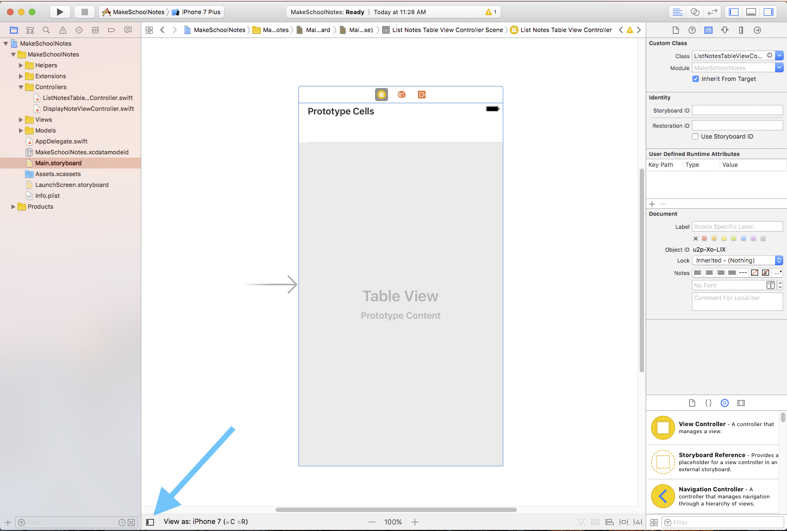

Table views are one of the most common visual elements used in iOS development and can be found in many of the apps bundled with iOS: *Messages*, *Photos*, *Maps*, and many more! Table views use *cells* to display lists of information.

Table views are instances of the `UITableView` class and can be created in two ways:

1. Programmatically
2. Visually using Interface Builder / Storyboards

(For more information on table views check out this [explanation](https://www.makeschool.com/tutorials/swift-concepts-explained/table-views))

#Make School Note's Table View Controller

For the table view in Make School Notes, we will be using a *table view controller* created in a *storyboard* as it is the quickest way to get started.

The starter project that you downloaded earlier already contains a table view controller. Let's take a look at it now.

> [action]
Click the *Project navigator* icon, expand the *MakeSchoolNotes* folder, and select the `Main.storyboard` file:
>

Table view controllers are the easiest way to use table views because they do a lot of the necessary table view setup for you. Table view controllers are instances of the `UITableViewController` class and, similar to table views, can be created programmatically or in Interface Builder.

The table view controller in the starter project was created in Interface Builder, we will want to be able manipulate it with code. This is very common situation when building iOS apps, so Interface Builder provides a way to link our table view controller with controlling code. To do this, we will use a feature of Xcode called *custom classes*. We want to set the custom class of our table view controller to *ListNotesTableViewController*. The *ListNotesTableViewController* class was included in the starter project and can be found in the `ListNotesTableViewController.swift` file.

> [action]
Set up the code connection by selecting the table view controller in your storyboard. (Note that when you have successfully selected the table view controller, it will be outlined in blue.) Click the *Identity inspector* icon, and set the *Class* field to *ListNotesTableViewController*.
>

Now that we have set the custom class of our table view controller, we will be able to make changes programmatically to our table view controller from inside the *ListNotesTableViewController* class.

> [action]
Click the *Project navigator* icon, expand the *Controllers* folder, and select the `ListNotesTableViewController.swift` file.
>

Currently, there is nothing interesting in this file, but we will change that soon!

#Displaying Information with our Table View

To inform our table view about which information to display, we must do some setup.

When displaying information, a table view *must* know two things:

1. The total number of cells
2. What information to display for each specific cell

Let's add the necessary code to our project -- we will discuss it afterwards.

> [action]
Add these two methods inside the scope of the *ListNotesTableViewController* class:
>
    // 1
    override func tableView(_ tableView: UITableView, numberOfRowsInSection section: Int) -> Int {
        return 10
    }
>   
    // 2
    override func tableView(_ tableView: UITableView, cellForRowAt indexPath: IndexPath) -> UITableViewCell {
      // 3
      let cell = tableView.dequeueReusableCell(withIdentifier: "listNotesTableViewCell", for: indexPath)
>   
      // 4
      cell.textLabel?.text = "Yay - it's working!"
>
      // 5
      return cell
    }

So what exactly is happening in the code above? We added two new methods to our class: `tableView(_:numberOfRowsInSection:)` and `tableView(_:cellForRowAtIndexPath)`. Both of these methods are part of the `UITableViewDataSource` protocol, which is a way of saying that these are methods we are implementing in order to answer questions the table view will ask us about the data it should display. This type of interaction is called a *delegate pattern* in which one object (the table view in this case) *delegates* to another object (our `ListNotesTableViewController` class) to help it accomplish its task. If you want you can read more about the delegate pattern [here](https://www.makeschool.com/tutorials/swift-concepts-explained/delegates).

Let's take a look at what's happening line by line:

1. We use `tableView(_:numberOfRowsInSection:)` to answer the table view's question about how many cells it should display. Often this number is set dynamically, because the information we want to display is dynamic - a list of notes created by the user, for example. But for now we will just use the hard-coded value `10` for demonstration.

2. `tableView(_:cellForRowAtIndexPath:)` is the table view's way of asking us, "what cell should I dsplay in this particular row of the table?"  We answer that question by constructing a `UITableViewCell`, updating that cell to look how we want, then returning that cell to the table view. To help us answer that question, the table view tells us the *indexPath*. The index path tells us which *section* and *row* the cell that we construct will belong to within the table view. Currently, our table view has 1 section (the default value) and 10 rows. We're going to ignore the `indexPath` for now, but we'll end up using it soon.

3. This line is fetching the actual cell that will be displayed in the table view. Option click on `cell` to see the type: `UITableViewCell`. The identifier, `"listNotesTableViewCell"`, is a unique name that we give to the *prototype cell* of a table view in our storyboard in Interface Builder. After setting the identifier, we can reference the prototype cell in code using the identifier. (We will set the identifier for our cell in the next step.) The reason identifiers exist is because we might want to have more than one kind of cell in our table view. Using different identifiers will allow us to reference the different prototype designs that we create in Interface Builder.

> [info]
> Notice that we are *dequeueing* a *reusable cell*. This is actually an interesting performance optimization: it turns out that it's fairly expensive to create and lay out a brand new `UITableViewCell`. So instead of creating new cells as they're about to display on screen, and destroying them as they scroll out of view, `UITableView` relies on giving us previously constructed cells for us to update with new information. If there's no recycled cells ready to be reused, `dequeueReusableCellWithIdentifier(_:forIndexPath:)` will give us a new one instead.
>
The nice thing is that this is all handled for you automatically by Apple's `UITableView` code. Apple's code figures out which cells it can reuse and when cells need to be created! All you have to do is call `dequeueReusableCellWithIdentifier(_:forIndexPath:)`.

4. Here we set the `text` property of our cell's `UILabel` to "Yay - it's working!".

5. We return the updated cell to be used within the table view.

##Setting the Identifier

Before we can run our app, we need to set the identifier of the prototype cell in the storyboard to match the identifier we used in the code above:

1. Open the *Document Outline*.

  

2. Select the *Table View Cell*.

  

3. Click the *Attributes inspector*.

  

4. Enter `listNotesTableViewCell` into the *identifier* field.

  

Notice that when we changed the *identifier* of the cell to `listNotesTableViewCell`, the name of the cell in the *Document Outline* changed from "Table View Cell" to `listNotesTableViewCell`.

#Running the App!

Now when you run your app, you should see something like this:

Congratulations - You have just successfully set up a table view controller! In the next tutorial we will customize our table view cells so that we can display our note's title and modification time.

>[info]
>###On this page, you should have:
>
>1. Learned how to link a view controller in Interface Builder to your code with a *custom class*. We linked the table view controller in Interface Builder to our custom ListNotesTableViewController class.
>2. Added the functions for `tableView(:_,numberOfRowsInSection)` and `tableView(:_,cellForRowAtIndexPath)`, to our ListNotesTableViewController class. These methods are the minimum required to be able to display custom information in our table view.
>3. Learned how to set a prototype table view cell's reuse identifier. In this case, we set it to `listNotesTableViewCell`.
