In the previous section, we set up our table view controller to display some sample data. Next, we're going to update our `UITableViewCell` UI by building a custom table view cell.

When we're done, each cell will display's the note's title and last modified timestamp.

# Setting a Custom Row Height

Before we create our custom cell, let's adjust the row height for each cell in our table view. This will make the cell height of each of the table view cells taller.

> [info]
By default, each row, or cell, in a `UITableView` will have a row height of 44pts.

<!-- break -->

> [action]
In `Main.storyboard`, increase the table view's row height to the following:
>
1. Select the `UITableView` from the _Document Outline_ in your storyboard.
1. Navigate to the _Size Inspector_ in the _Utilities area_.
1. Find the _Row Height_ field and change it's value from `44` to `60`.
>
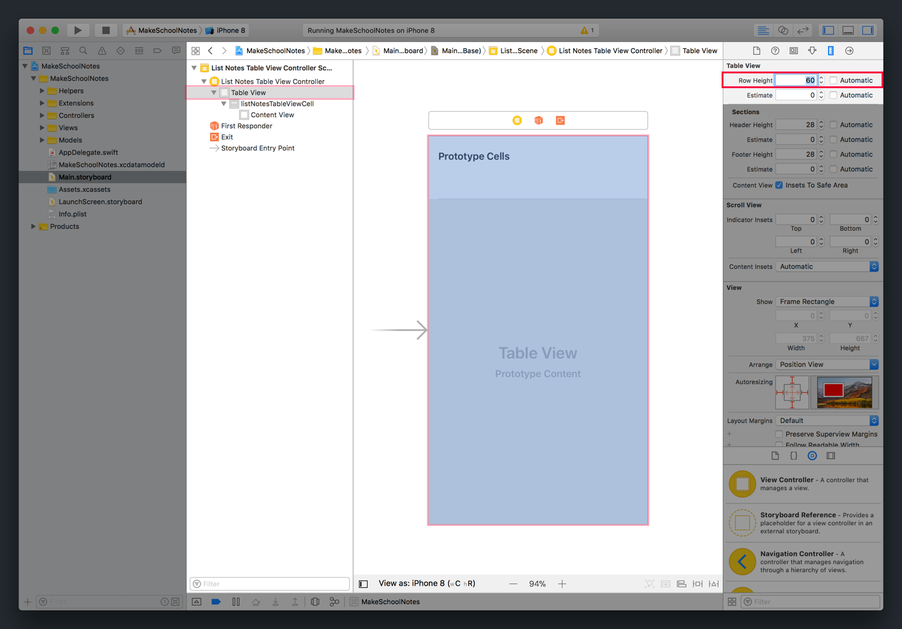

Making the height of each cell taller gives us a little more room to layout our UI for each note table view cell.

# Setting Our Cell UI

With our heighten cells, let's layout our `UITableViewCell` UI.

> [action]
Create a vertical stack view with two `UILabel` on your prototype cell:
>
![ms-video(https://s3.amazonaws.com/mgwu-misc/Make+School+Notes/p02_creating_custom_table_view_cells/create_vertical_stack_view.mp4)
>
Step-by-step:
>
1. Drag two labels from the _Object Library_ onto your blank prototype cell. Make sure to position both labels so that one is above the other.
1. Select both labels simultaneously. You can do this by selecting one label and shift-clicking on the other label.
1. Click the _Embed In Stack_ button. If the labels are positioned correct, _Interface Builder_ should create a vertical stack view with the selected label.

Next, we'll set our _auto-layout_ constraints for our stack view.

> [action]
Set constraints for each edge of the stack view:
>
![ms-video(https://s3.amazonaws.com/mgwu-misc/Make+School+Notes/p02_creating_custom_table_view_cells/set_stack_view_constraints.mp4)
>
Step-by-step:
>
1. Select the stack view using the _Document Outline_.
1. Click the _Add New Constraints_ button and add the following constraints:
    - (Stack View) Top Edge 0pts from Super View (Content View) Top Edge
    - (Stack View) Leading Edge 15pts from Super View Leading Edge
    - (Stack View) Trailing Edge 15pts from Super View Trailing Edge
    - (Stack View) Bottom Edge 0pts from Super View Bottom Edge

Finally, we'll need to add an equal height constraint to our labels to remove some constraint ambiguity.

> [action]
Set an equal height constraint for both labels within the stack view:
>
![ms-video(https://s3.amazonaws.com/mgwu-misc/Make+School+Notes/p02_creating_custom_table_view_cells/set_equal_height_constraint.mp4)
>
Step-by-step:
>
1. Expand your stack view in your _Document Outline_.
1. Select both labels within the stack view.
1. With both labels selected, click the _Add New Constraints_ button.
1. In the resulting popup, tick the _Equal Heights_ checkbox and click the _Add Constraints_ button.

Nice! Our cell's UI is coming along. So far you should have the following:

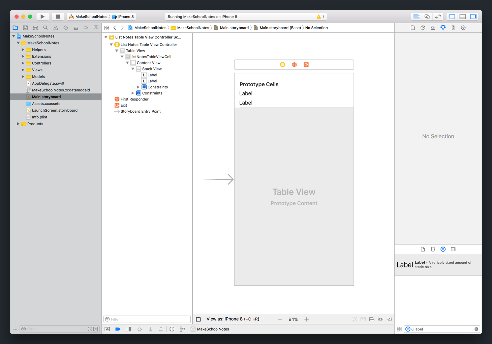

## Adding Some Pizzazz

With our cell's layout setup correctly, it's time to add some styling to our labels.

Let's start with the top label.

> [action]
In `Main.storyboard`, set the following attributes for the top (note title) label:
>
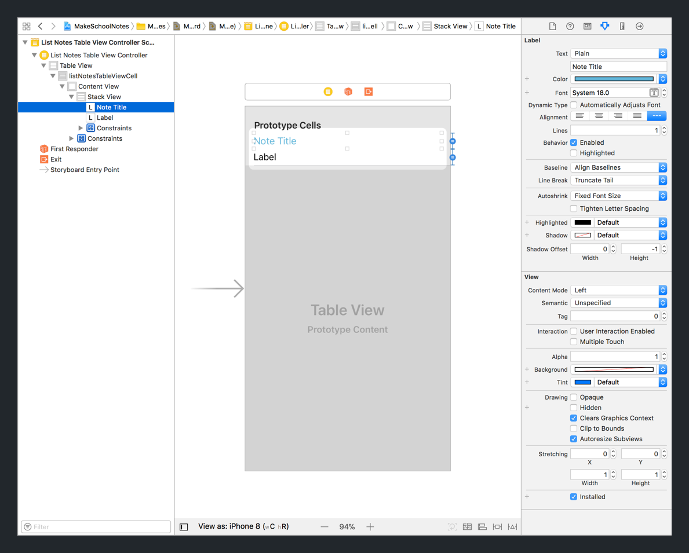
>
**Attributes:**
>
- _Text_: Change from `Label` to `Note Title`
- _Font_: Change from `System 17.0` to `System 18.0`
- _Font Color_: Change from `Black` to the hex color `#53A8D2`

Next, we'll change the attributes for the last modified timestamp label.

> [action]
In `Main.storyboard`, set the following attributes for the bottom (last modified timestamp) label:
>
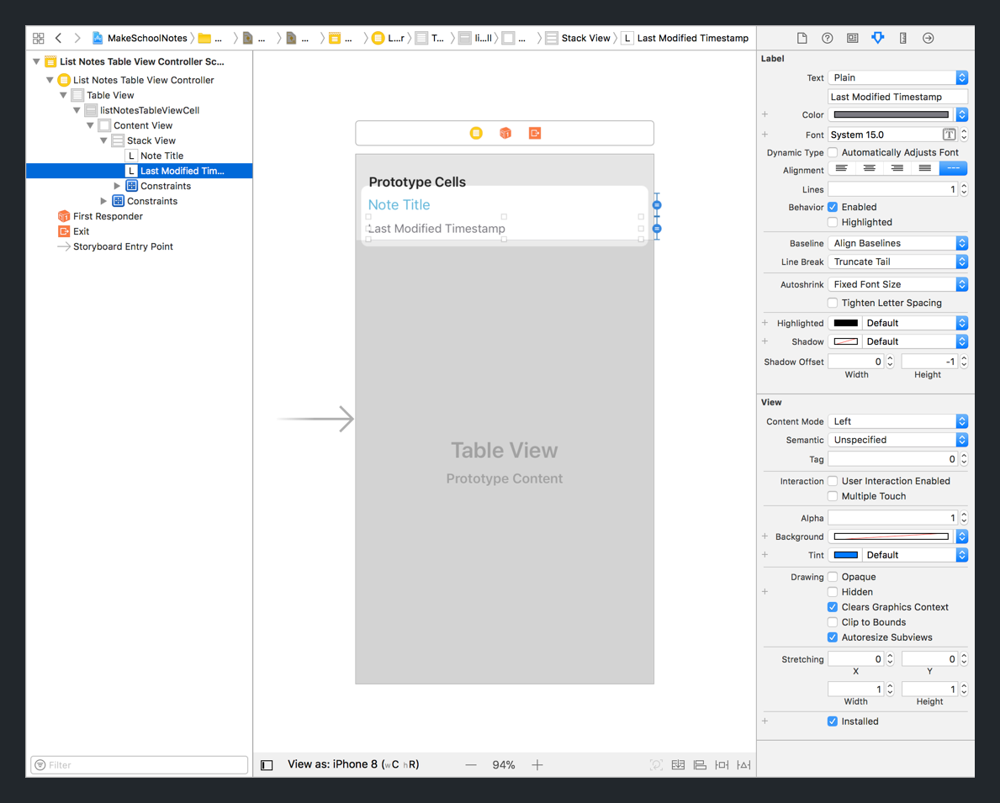
>
**Attributes:**
>
- _Text_: Change from `Label` to `Last Modified Timestamp`
- _Font_: Change from `System 17.0` to `System 15.0`
- _Font Color_: Change from `Black` to the hex color `#67656C`

Next, we'll take a look at connecting our storyboard cell to it's corresponding Swift file.

# Setting The Cell Custom Class

Already included in your project, in the _Views_ group, is our custom table view cell subclass named `ListNotesTableViewCell`.

> [action]
Open `ListNotesTableViewCell.swift` from your _Project Navigator_.
>
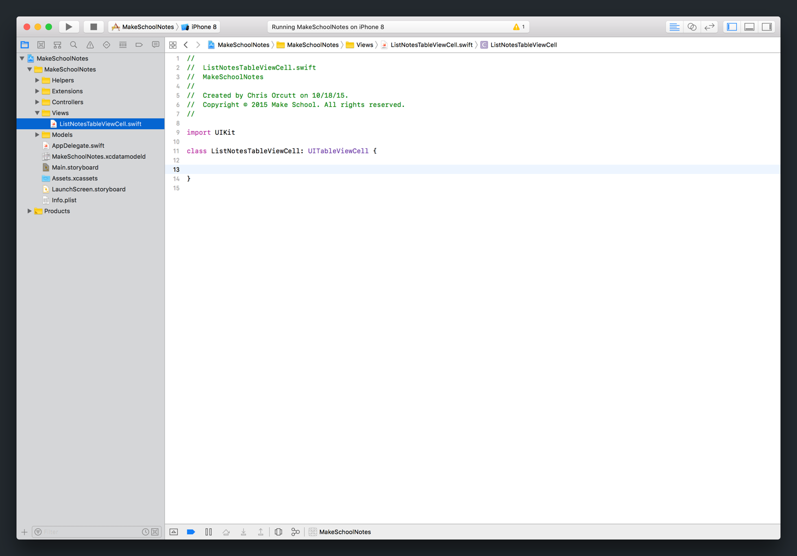

Right now, aside from the class definition, your source file should be empty.

Similar to creating a custom subclass our table view controller, to implement a `UITableViewCell` subclass, we'll first need to set it's corresponding storyboard object's custom class.

> [action]
In `Main.storyboard`, set your storyboard prototype cell's custom class:
>
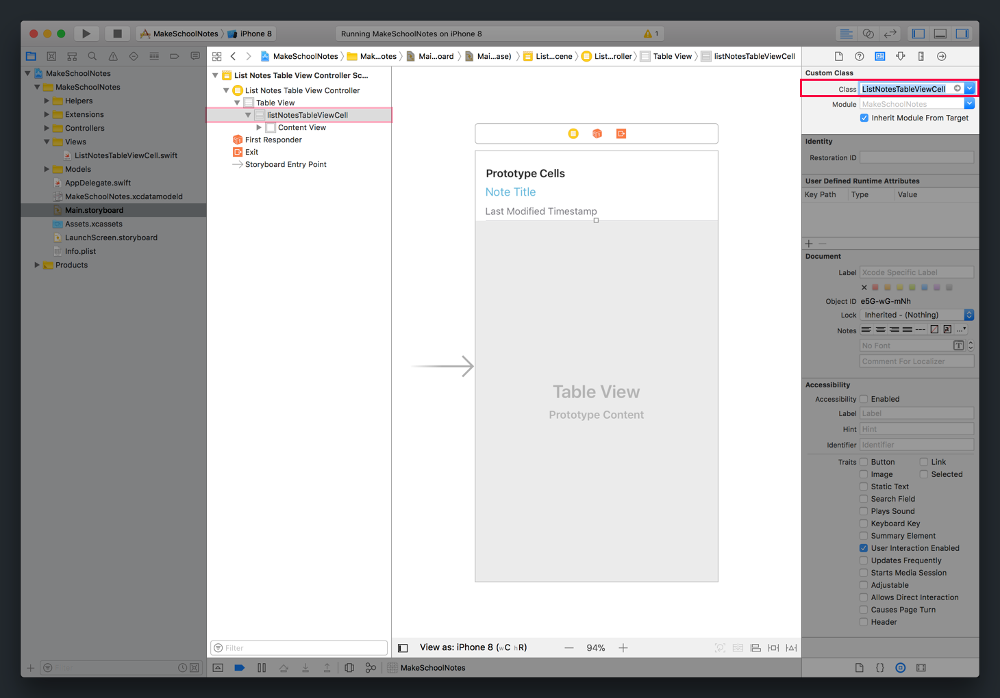
>
Step-by-step:
>
1. Select your storyboard table view cell using the _Document Outline_.
1. Navigate to the _Identity Inspector_ in the _Utilities area_.
1. In the _Custom Class_ section, set the _Class_ attribute to `ListNotesTableViewCell`. Auto-complete should help you select the correct class.

Next, we'll need to create a way to access the title and last modified labels on our `ListNotesTableViewCell` class. Without a way to access both labels, we won't be able to set or modified them with code.

Sound familiar? `IBOutlet` to the rescue!

# Creating Cell IBOutlets

We'll need to create a corresponding `IBOutlet` for each of our custom cell's labels. This will allow us to set and access each label programmatically.

Let's start by creating an `IBOutlet` for our note title label.

> [action]
First start by opening the _Assistant Editor_:
>
1. Open `Main.storyboard` from your _Project Navigator_.
1. Click on the _Show the Assistant Editor_ button in the tool bar. 
1. (Optionally) Hide both the _Navigator_ and _Utilities_ panes to create more screen space for the _Assistant Editor_. 
1. (Troubleshooting) If you don't see the `ListNotesTableViewCell.swift` file show up in the second editor window, change the _Assistant Editor_ file by selecting `Manual > MakeSchoolNotes > MakeSchoolNotes > Views > ListNotesTableViewCell.swift` in the dropdown above. 

With our _Assistant Editor_ displaying storyboard file and `ListNotesTableViewCell.swift` source code side-by-side, we can create each label's `IBOutlet`.

> [action]
Create a `IBOutlet` for each corresponding label:
>
![ms-video(https://s3.amazonaws.com/mgwu-misc/Make+School+Notes/p02_creating_custom_table_view_cells/create_label_outlets.mp4)
>
For each label:
>
1. Select the label within the stack view using the _Document Outline_.
1. Control-click from the label to the `ListNotesTableViewCell` class definition in the _Assistant Editor_.
1. Name the `IBOutlet` accordingly:
    - _Title Label_: `noteTitleLabel`
    - _Last Modified Timestamp_: `noteModificationTimeLabel`

When you're done, you can exit the _Assistant Editor_ and switch back to the _Standard editor_.

With our new `IBOutlet` connections, we're now able to access each label property in our `ListNotesTableViewCell`!

# Type Casting Our Cell

Before we move on, we need to make one additional change to table view data source code.

> [action]
Open `ListNotesTableViewController.swift`. Take another look at our current implementation of `tableView(_:cellForRowAt:)`.

You should see the following code:

```
override func tableView(_ tableView: UITableView, cellForRowAt indexPath: IndexPath) -> UITableViewCell {
    let cell = tableView.dequeueReusableCell(withIdentifier: "listNotesTableViewCell", for: indexPath)
    cell.textLabel?.text = "Cell Row: \(indexPath.row) Section: \(indexPath.section)"

    return cell
}
```

In the code above, our code uses `dequeueReusableCell(withIdentifier:for:)` to retrieve the appropriate table view cell. The string identifier we've provided as a parameter, matches the _Identifier_ in our storyboard's _Identifier_ attribute.

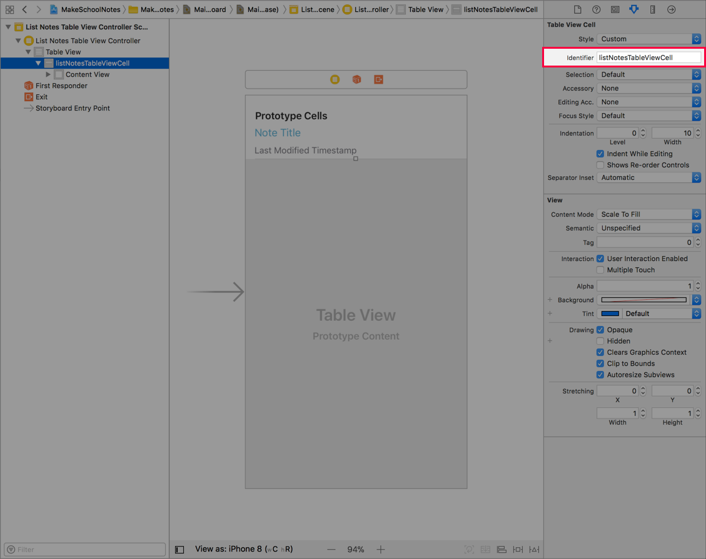

However, our code doesn't know that our storyboard cell has a custom class of `ListNotesTableViewCell`.

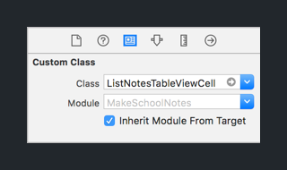

Right now our code thinks cell has the default `UITableViewCell` type.

> [action]
Option-click on the `cell` constraint. You should see the following:
>
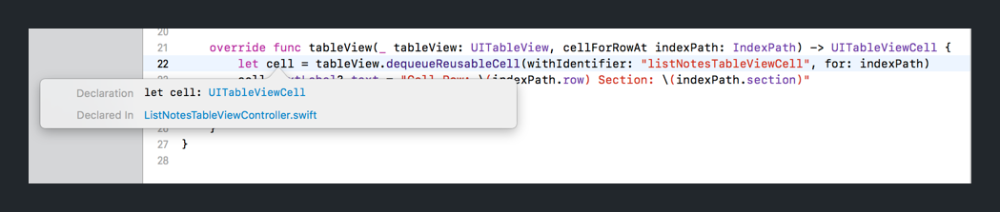
>
Since Swift is statically-typed, we can option-click on constants/variables and the compiler will show a popup with the current type of `cell`.


 To change this, we'll need to use type casting to tell our code that the cell from the identifier has a custom class of `ListNotesTableViewCell`.

> [action]
In `ListNotesTableViewController.swift`, downcast the cell in `tableView(_:cellForRowAt:)` to the correct custom class.
>
```
override func tableView(_ tableView: UITableView, cellForRowAt indexPath: IndexPath) -> UITableViewCell {
    let cell = tableView.dequeueReusableCell(withIdentifier: "listNotesTableViewCell", for: indexPath) as! ListNotesTableViewCell
>
    return cell
}
```
>
In the code above, we type cast our cell constant by using the `as` keyboard with the force unwrap optional `!`, followed the custom class we want type cast to, in this case, `ListNotesTableViewCell`. This is referred to as _downcasting_.

<!-- break -->

> [info]
Be careful when downcasting! If the storyboard cell doesn't have it's custom class set to the type you're force casting to, this code will crash your app!

After type casting our cell, you can option-click on our cell constant to see that the type has changed from `UITableViewCell` to `ListNotesTableViewCell`.

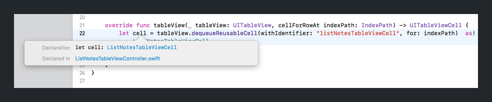

Now that our cell has the correct type, we can also access the `ListNotesTableViewCell` properties. Let's set both labels that we created an `IBOutlet` for.

> [action]
In `ListNotesTableViewController.swift`, update the method `tableView(_:cellForRowAt:)` to set each of the labels:
>
```
override func tableView(_ tableView: UITableView, cellForRowAt indexPath: IndexPath) -> UITableViewCell {
    let cell = tableView.dequeueReusableCell(withIdentifier: "listNotesTableViewCell", for: indexPath) as! ListNotesTableViewCell
    cell.noteTitleLabel.text = "note's title"
    cell.noteModificationTimeLabel.text = "note's modification time"
>
    return cell
}
```

**Important**: Verify that the code above was updated in your `ListNotesTableViewController.swift` and not accidentally added to your custom table view cell instead.

## Running The App

We've created and implemented a custom table view cell with a new UI! Let's check our progress to make sure everything works as expected. Build and run your app.

At this point, your app should look like the following:

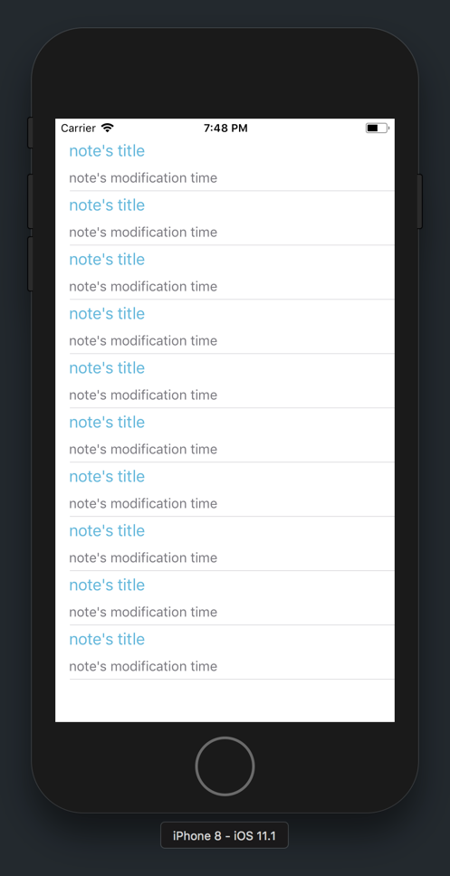

If everything looks right, you're ready for the next section!
