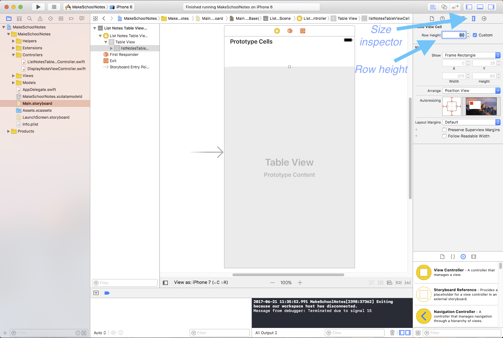
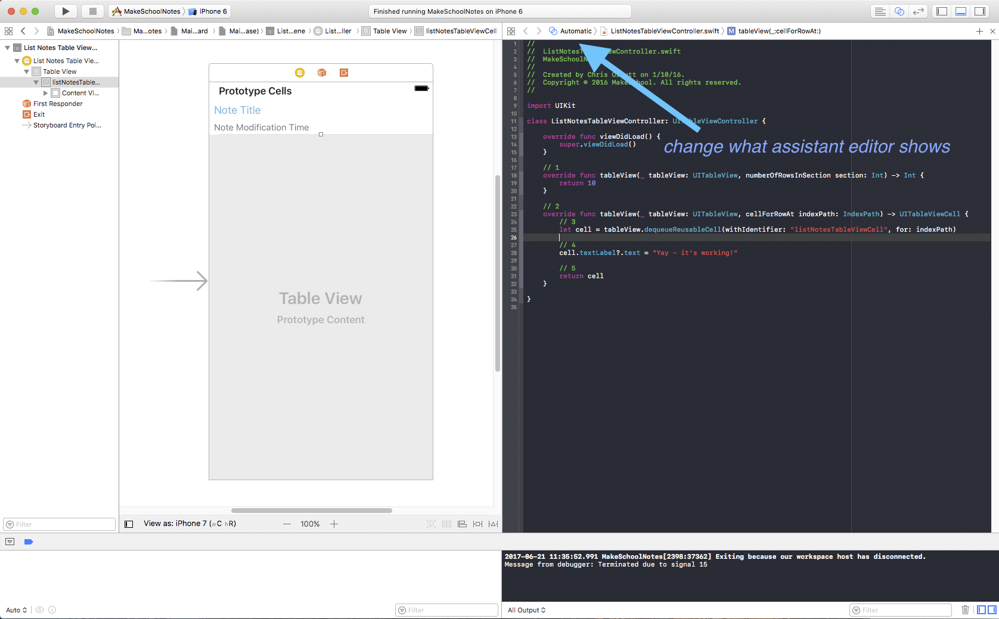

In the last step, we got a table view up and running. We're going to use this table view to display a list of each of the notes the user has made. We're going to customize the table view cells so that we can display the note's title and modification time.

##Resizing our Cell

We're going to need two labels to display the note's title and modification time. To ensure we have enough room for both of our labels, let's make the cell a little bit bigger.

> [action]
Select the *listNotesTableViewCell* in the *Document Outline*, click the *Size inspector* icon, and change the *Row Height* to 60:
>

Now let's change the height of the table view to match.

> [action]
Select the *Table View* in the *Document Outline*, click the *Size inspector* icon, and change the row height to 60:

Notice that we had to change the row height for both our table view and our table view cell!

#Adding Labels to our Cell

<!-- MAYBE LATER ACTION: Currently the labels don't use autolayout at all. Maybe later set them up to use it.  -->

Now that we have enough room, let's add our labels!

> [action]
Add two labels to the *listNotesTableViewCell* prototype. Open *Main.storyboard*, find the *object library* on the bottom of the right-hand side panel. From the object library, drag two labels onto the prototype cell. See the video below:
>

>
Replace the text of the top label with `Note Title` and the bottom with `Note Modification Time`. Your cell should look something like this when finished:
>

#Customizing our Label's Text

Let's customize the look of our labels by changing the text size, font, and color.

> [action]
> Select a label from the Document Outline, click the Attribute inspector icon, and experiment with changing the *Color* and *Font* fields. It's also a pretty good idea to increase the label's width. To do that, select the label and click and drag the right middle bounding box. Labels might look something like this afterwards:
>

<!--  -->

> [info]
> If you want to make your cell look like mine, I did the following:
>
> Note title label
>
> * 18.0 point System font
> * Hex color #53A8D2
>
> Note modification time label
>
> * 15 point System font
> * Hex color #67656C

Our cell is starting to come together, but we haven't finished yet!

#Connecting our Cell to Code

Because we want to be able to access our custom table view cell in code, we will need to give it a custom class.

> [action]
Select the *listNotesTableViewCell* in the *Document Outline*, click the *Identity inspector* icon, and set the *Class* field to "ListNotesTableViewCell":
>

>
The *ListNotesTableViewCell* class was included in the starter project and can be found in the `ListNotesTableViewCell.swift` file within the *Views* folder in your Project navigator.

<!-- html comment to break boxes -->

> [info]
> Notice the naming convention we are following: Our cell in Interface Builder is named "listNotesTableViewCell" (first letter is lowercase) and  we are connecting that cell to a class named "ListNotesTableViewCell" (first letter is uppercase). This is a common convention in iOS development.

Now that we have set the class of our *listNotesTableViewCell* to "ListNotesTableViewCell", let's take a look at the contents of the `ListNotesTableViewCell.swift` file.

> [action]
Click on the *Project navigator* icon, expand the *Views* folder, and select the `ListNotesTableViewCell.swift` file:
>

We want to use this class to alter what our table view cell displays, but we currently do not have any way to reference the labels we created in Interface Builder from code. To access the labels from this class, we must set up another type of connection called an `IBOutlet`.

#Introducing IBOutlets

`IBOutlets` are used to connect an object's properties in Interface Builder to properties in their respective classes. (The "IB" in "IBOutlet" stands for "Interface Builder".) In our case, we want to connect the two labels in our *listNotesTableViewCell* in Interface Builder, to two label properties in our *ListNotesTableViewCell* class.

When creating `IBOutlets` we will often use the *Assistant Editor*. The *Assistant Editor* provides us a way to simultaneously view our object in Interface Builder and its accompanying source file.

> [action]
Open the *Assistant Editor* as follows:
>
1. First, open `Main.storyboard`.
2. Click the *Assistant Editor* icon.
>
  
>
3. Hide the *Navigator* and *Utilities* menus.
>
  
>
4. Change the file the *Assistant Editor* is displaying by selecting: `Manual > MakeSchoolNotes > MakeSchoolNotes > Views > ListNotesTableViewCell.swift`
>
  

With the *Assistant Editor* open, connecting our labels from Interface Builder to the *ListNotesTableViewCell* class is very easy: all we have to do is select the label and ***Control-click*** from the label to somewhere inside the *ListNotesTableViewCell* class definition.

> [action]
Add `IBOutlets` to the the *ListNotesTableViewCell* class as follows:
>

We can now access the labels of our *listNotesTableViewCell* through the `noteTitleLabel` and `noteModificationTimeLabel` instance properties of the *ListNotesTableViewCell* class! One last small change and then we will be ready to run our app!

#Typecasting our Cell to ListNotesTableViewCell

> [action]
Switch back to the *Standard Editor*, show the *Navigator* and *Utilities* menus, and select the `ListNotesTableViewController.swift` file.
>

Now that we are using a custom cell with type *ListNotesTableViewCell*, we must make some changes to our table view methods. Let's make the necessary changes and then discuss what was changed afterwards.

> [action]
Replace the content of the `tableView(tableView: UITableView, cellForRowAtIndexPath indexPath: NSIndexPath) -> UITableViewCell` method with the following:
>
    // 1
    let cell = tableView.dequeueReusableCell(withIdentifier: "listNotesTableViewCell", for: indexPath) as! ListNotesTableViewCell
>    
    // 2
    cell.noteTitleLabel.text = "note's title"
    cell.noteModificationTimeLabel.text = "note's modification time"
>    
    return cell

So what did we change in the code above?

1. In this line the only difference between our previous implementation is that we appended `as! ListNotesTableViewCell` to the end. That code is a *downcast*, it's how we tell the compiler that we expect `dequeueReusableCellWithIdentifier(_:forIndexPath:)` to return a more specific kind of `UITableViewCell`, in this case a `ListNotesTableViewCell`. The downcast works because `ListNotesTableViewCell` is a subclass of `UITableViewCell`.

2. Because `cell` now has type *ListNotesTableViewCell*, we can access the `noteTitle` and `noteModificationTime` properties that we just created.

#Running the App!

We have now finished making our custom table view cells and are ready to run the app! Your app should look similar to this:

Notice that the first cell is slightly hidden behind the *status bar*. We'll fix that in the next section!

>[info]
>###On this page, you should have:
>
>1. Learned how to resize a table view cell in Interface Builder. We gave our prototype cell a height of 60 points.
>2. Added two labels to the cell, one for the note's title and one for the note's modification time.
>3. Learned how to customize the look and feel of the labels by changing some of their visual properties.
>4. Connected the prototype cell to our code by assigning it the custom class `ListNotesTableViewCell`.
>5. Connected the labels from our prototype cell to code using *IBOutlet*s.
>6. Learned how to *downcast* an instance of an object to a subclass type. We downcast the `UITableViewCell` returned by `dequeueReusableCellWithIdentifier(_:forIndexPath:)` to our custom `ListNotesTableViewCell`.
