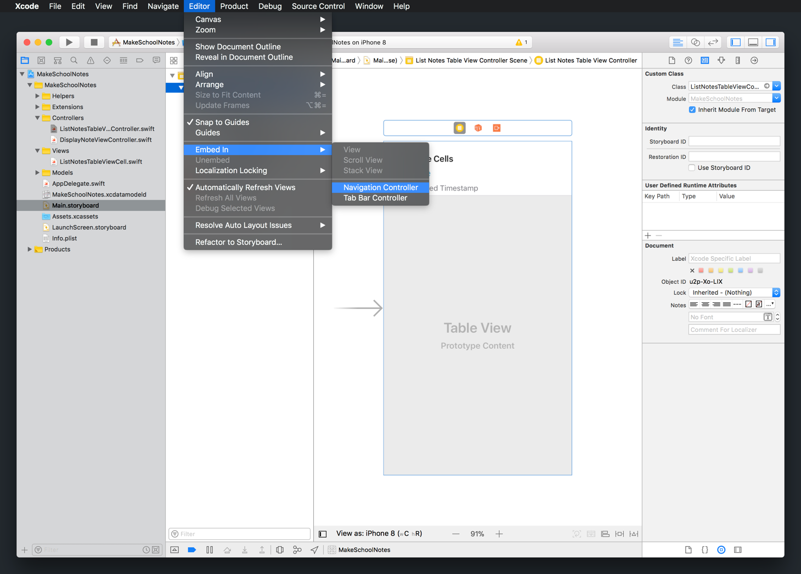
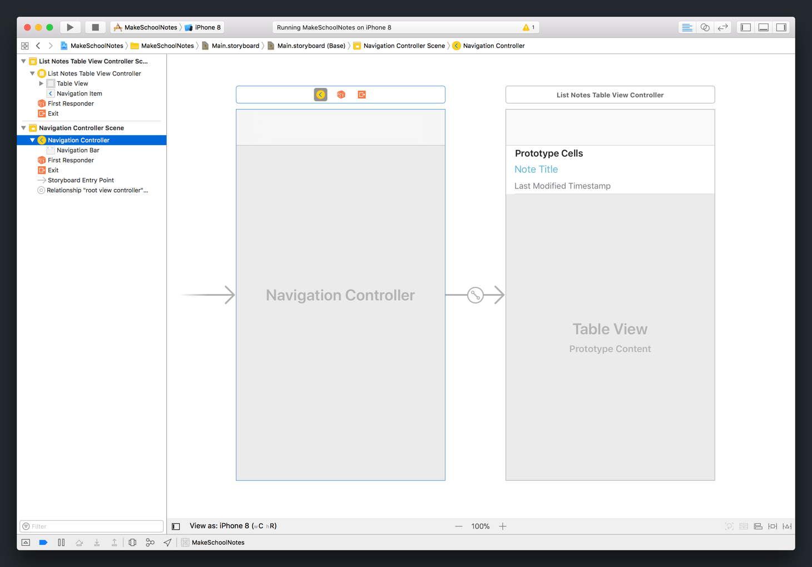
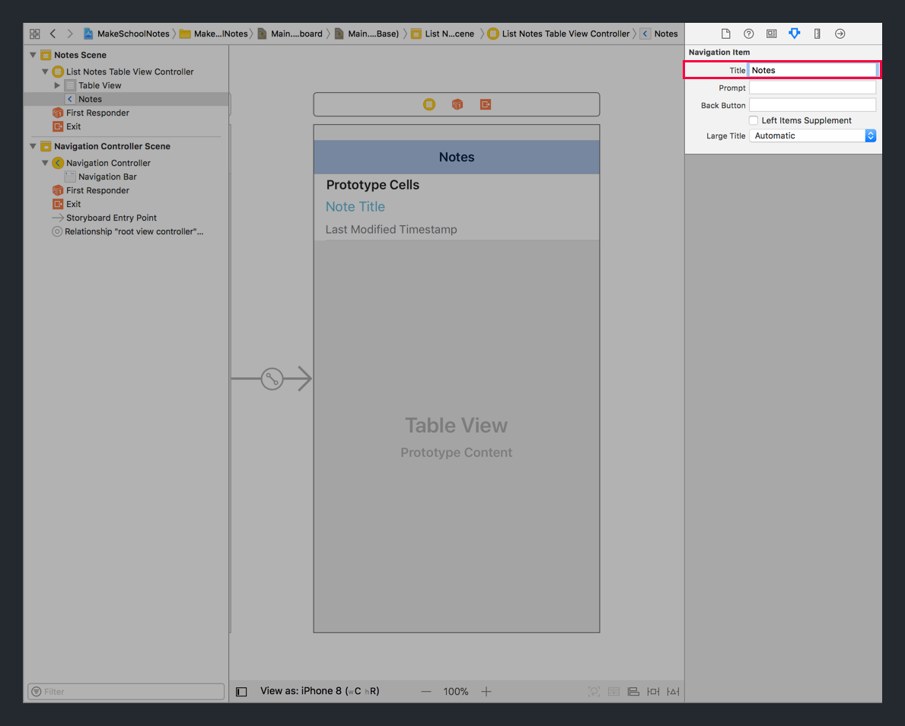
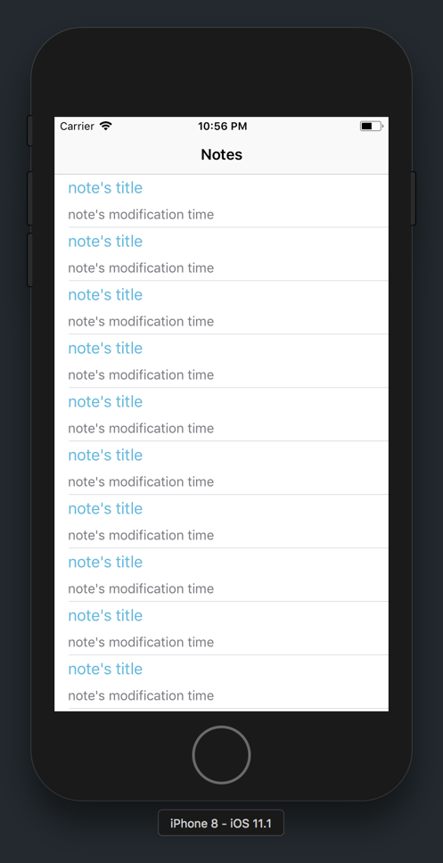

A `UINavigationController` is a view controller subclass that makes navigation between multiple view controllers easier. In addition to easier navigation, a navigation controller also has a lot of built-in functionality that we'll explore in this section.

Let's look at Apple's Calendar app to get a better idea of how a navigation controller works.

Let's start with the calendar view of the entire year:

The top translucent bar at the top of the view controller is called the _navigation bar_. The navigation bar has a type of `UINavigationBar` and is automatically configured and setup when we use a navigation controller.

If we tap on a specific month, we can see that navigation controller has changed from displaying the year view controller to the month view controller. The month view controller has been _pushed_ on top of the year-view.

If we look at the navigation bar at the top, we can also see that there's a back button. Because the year view controller is still below the month view controller, the navigation bar automatically shows a back button for you to _pop_ back to the previous (year) view controller.

As you can see, the `UINavigationController` provides a lot of convenient functionality for navigating back and forth between multiple view controllers.

From the month view controller, if we tap on a specific day, the navigation controller will _push_ the week view controller onto the current _navigation stack_.

So far, our navigation controller stack (in order from front to back) has the following view controllers:

1. Week View Controller
1. Month View Controller
1. Year View Controller

Each view controller is _pushed_ onto the navigation stack and covers the previous view controller. If at any time, we want to go back to the previous view controller, we can tap the back button to _pop_ the front-most view controller off the stack.

For example, if we hit the back button now, the week view controller would be popped off of the navigation stack and the next front-most view controller would be displayed. In this case, the month view controller.

In our _Notes_ app, we'll have two different view controllers.

The first is our existing `ListNotesTableViewController`. This will always be the bottom most view controller on our navigation stack. It will display a list of all of our notes.

Next, we'll need another view controller to help us display individual notes. Lucky for you, our project already includes `DisplayNoteViewController` for this specific purpose.

When the user wants to create or view a note, we'll push an instance of `DisplayNoteViewController` on to our navigation stack. In this view controller, a user can create, edit, or view a note.

But first, we'll need to implement our own `UINavigationController`.

# Implementing Our Navigation Controller

As you can see above, navigation controllers include a lot of functionality for navigating between view controllers. They're also super beginner-friendly and easy to set up.

> [action]
Open `Main.storyboard` and embed our existing table view controller in a navigation controller:
>
1. Select the existing table view controller.
1. With the table view controller selected, in the Xcode menu, select `Editor > Embed In > Navigation Controller`.
>

You should see your existing table view controller embed within the navigation controller:

## Adding A Navigation Bar Title

Another useful feature that `UINavigationController` provides, is the ability to give a title name to the top-most view controller that the navigation controller is displaying. This can be helpful for giving users a context for what they're looking at on the screen.

Our table view controller will display a list of notes that the user has created. Let's add a title to our navigation bar.

> [action]
Set a title for our table view controller:
>
1. Select the _Navigation Item_ by clicking on the navigation bar.
1. Navigate to the _Attributes Inspector_ in the _Utilities area_.
1. In the _Title_ field, set the value from empty to `Notes`.
>

## Running the App

We've embed our existing table view controller within a navigation bar. This will allow us to navigate between our `DisplayNoteViewController` later in this tutorial. Let's build and run to make sure everything still works!

At this point, your app should look like the following:

Ta-da! Our new navigation bar is looking fineee.
