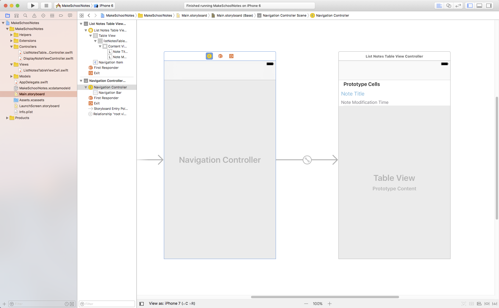

The *navigation controller* is a special controller that manages how other view controllers are displayed. Like table views, navigation controllers are very common in iOS apps.

Let's use Apple's Calendar app to demonstrate the functionality provided by a navigation controller. The first view of the Calendar app consists of a calendar that shows the entire year:

The top grey section you see in the Calendar app is called the *navigation bar* and is provided by the navigation controller. When we tap on a specific month, a view presenting the month appears. We can think of the month view as having been pushed on top of the year view. Because there are views below the currently displayed view, we now have a *back button* in the navigation bar that can be used to go back to the previous view. This functionality is provided for free by the navigation controller.

If we select a specific day, we will once again go another view deeper into the app. To go back to any of the previous views, all we have to do is use the back button.

Notice that the **Calendar** app has a hierarchical (layered) structure, meaning that the only way to get to the *day screen* is to go through the *year* and *month screens* first. Navigation controllers are best suited for apps that have a similar hierarchical structure.

In Make School Notes we will have two different views: a top view that display all the notes, and a view layer that displays a specific note after a user taps a specific table view cell. Because this is a hierarchical structure, Make School Notes is a great place to use a navigation controller.

> [info]
> When working with navigation controllers, we're working with what's called a *navigation stack*, which is simply a list of the views we've gone through. When we transition to a new view, that's called *pushing* a view on to the stack, and when we go back, that's called *popping* the current view from the stack.

#Setting up the Navigation Controller

Navigation controllers provide us with some pretty complex functionality; luckily they are incredibly easy to set up.

> [action]
Set up a navigation controller by selecting the *List Notes Table View Controller* from the Document Outline and selecting Editor > Embed In > Navigation Controller.
>

You should now see a navigation controller in your storyboard:

#Naming the View

Another cool feature of a navigation controller is the ability to display the title of the current view in the navigation bar. Let's give our *List Notes Table View Controller* the name "Notes".

> [action]
Select the *Navigation Item* in the Document Outline, click on the Attributes inspector, and set the *Title* field to "Notes".
>

#Running the App!

Your app should now look something like this:

Great job -- our note app is really starting to come along!

>[info]
>###On this page, you should have:
>
>1. Learned the basics of what a navigation controller does.
>2. Added a navigation controller to your app by embedding the `ListNotesTableViewController` in one.
>3. Learned how set the title of a view so that it displays in the navigation bar. We set the `ListNotesTableViewController`'s title to Notes.
