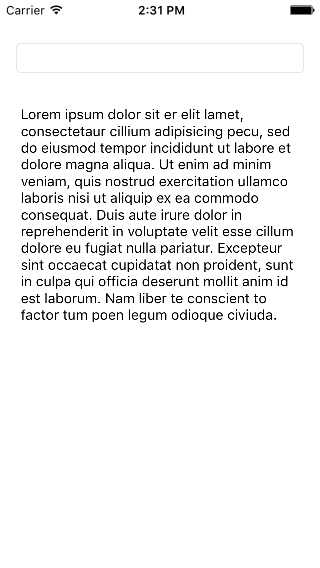

Now that we have a decent looking interface to list all of our notes, let's add a new view controller which can display our notes!

# Adding a New View Controller

For Make School Notes, when a user clicks on a note in the table view, we want to display the content of the note in a new screen. (Remember that in iOS, each view controller can display one screen.)

> [action]
Add a *View Controller* from the Object library to your storyboard. Set the custom class of this view controller to *DisplayNoteViewController*.
>

## Displaying and Editing Text

In our new *Display Note View Controller*, we want to give our users the ability to view and optionally edit the title and content of their notes. In this case, using a label would not be sufficient because users cannot change the text of labels. Luckily there are two other objects that will give us this functionality: the *text field* and the *text view*.

The text field is best used when you want to capture a single line of text from the user, while the text view is best used when you want to capture multi-line text. In Make School Notes we will use a text field for our note's title and a text view for our note's content. Let's add one of each to our project now.

> [action]
Add a *Text Field* to the top of the *Display Note View Controller* and a *Text View* underneath. Resize your objects as necessary, they should look as follows:
>

Let's also ensure that our text field and text view will appear on screen correctly by using a feature of Auto Layout called "Reset to Suggested Constraints". As this point, you should not be worried about Auto Layout, this step is only to ensure these objects appear on screen correctly. We will go in-depth into Auto Layout in later tutorials.

> [action]
Select the *Display Note View Controller* from the Document Outline, then select `Editor > Resolve Auto Layout Issues > Reset to Suggested Constraints`.
>
 

## Running the App!

Before testing to ensure our Display Note View Controller is setup correctly, we must set the Display Note View Controller to be the *Initial View Controller*. (We must do this because currently we have no way to transition between view controllers.) The Initial View Controller is the first view controller that is displayed when your app is launched.

> [action]
Select the Display Note View Controller from the Document Outline, select the Attributes inspector, and click the *Is Initial View Controller* button.
>

Now when you run, your app should display the Display Note View Controller as follows:

In the next tutorial let's add the functionality that allows us to transition between screens!
