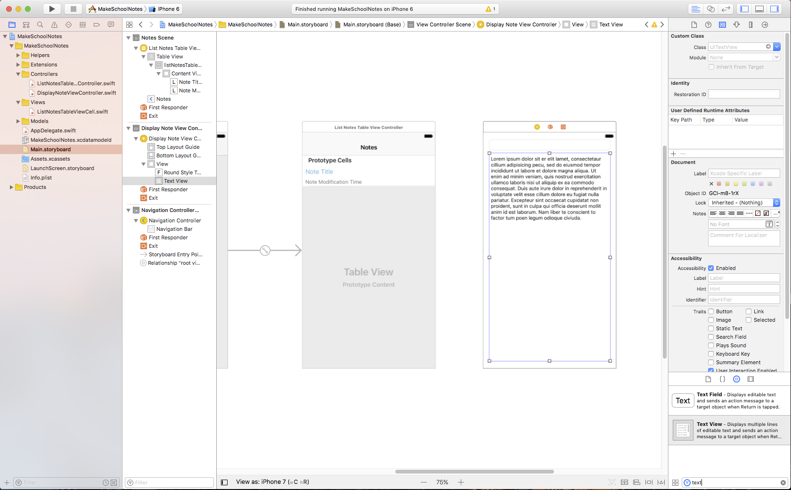
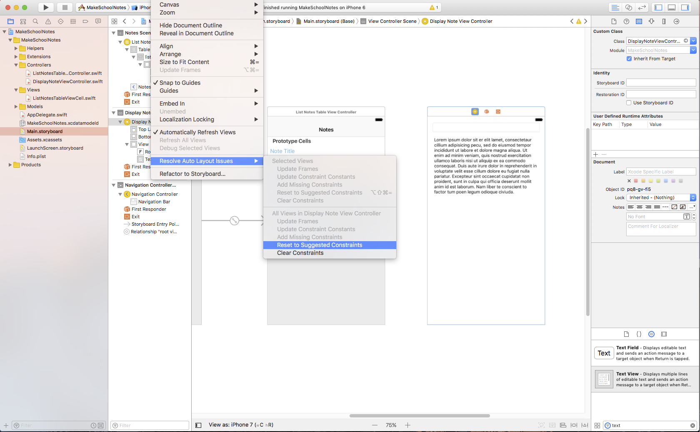
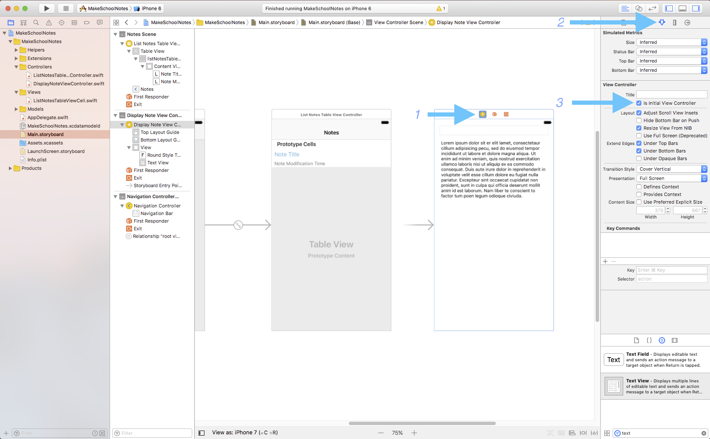
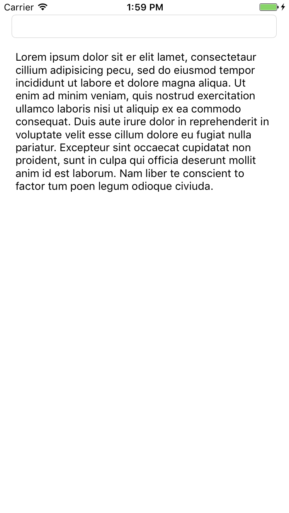

For Make School Notes, when a user clicks on a note in the table view, we want to display the content of that note in a new view. Remember that in iOS, each view controller can display one view.

> [action]
Add a *View Controller* from the Object library to your storyboard by dragging it to a blank area. Set the custom class of this view controller to *DisplayNoteViewController*.
>

#Displaying and Editing Text

In our new Display Note View Controller, we want to give our users the ability to view and optionally edit the title and content of their notes. For the editing case, using a label would not be sufficient because users cannot change the text of labels. Luckily there are two other objects that will give us this functionality: the *text field* and the *text view*.

The text field is best for when you want to capture a single line of text from the user, while the text view is best for when you want to capture multiple lines of text. In Make School Notes we will use a text field for the note's title and a text view for the note's content. Let's add one of each to our project now.

> [action]
Add a *Text Field* to the top of the Display Note View Controller and a *Text View* underneath. Resize your objects as necessary, they should look as follows:
>

We're going to ensure that our text field and text view will appear on screen correctly by using *Auto Layout*. Auto Layout is Apple's system for laying out views, it was built to give programmers and designers the power and flexibility to define layouts that look good on all devices and resolutions. As this point, you shouldn't worry too much about Auto Layout; we will go in-depth into Auto Layout in later tutorials.

> [action]
Select the *Display Note View Controller* from the Document Outline, then select `Editor > Resolve Auto Layout Issues > Reset to Suggested Constraints`.
>
 

#Running the App!

In order to test that our Display Note View Controller is set up correctly, we are going to set the Display Note View Controller to be the *Initial View Controller*. The Initial View Controller is the first view controller that is displayed when your app is launched. We're going to temporarily make the Display Note View Controller the initial view controller because we haven't yet created a transition from the List Notes Table View Controller to the Display Note View Controller.

> [action]
Select the Display Note View Controller from the Document Outline, select the Attributes inspector, and click the *Is Initial View Controller* button.
>

Now when you run, your app should display the Display Note View Controller, something like this:

In the next tutorial we'll add the functionality that allows us to transition between views!

>[info]
>###On this page, you should have:
>
>1. Created a new view controller with custom class `DisplayNoteViewController` in storyboard.
>2. Added a text field and text view to your `DisplayNoteViewController`.
>3. Used the Reset to Suggested Constraints feature of Auto Layout to ensure the fields display correctly
>4. Set your Display Note View Controller to be the initial view controller so you can run and check out your app.
