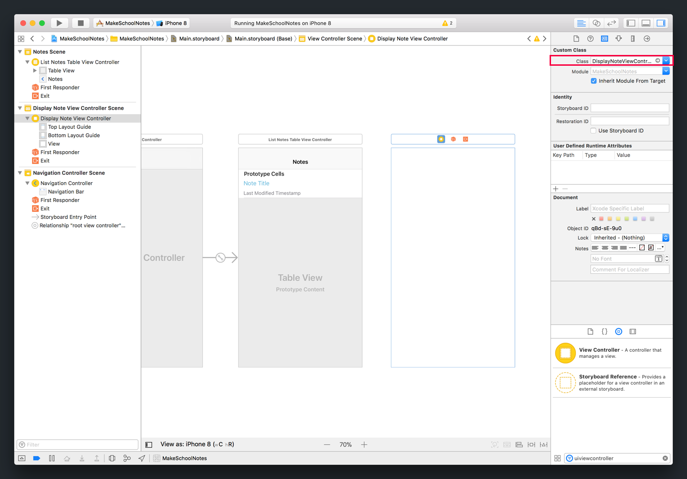
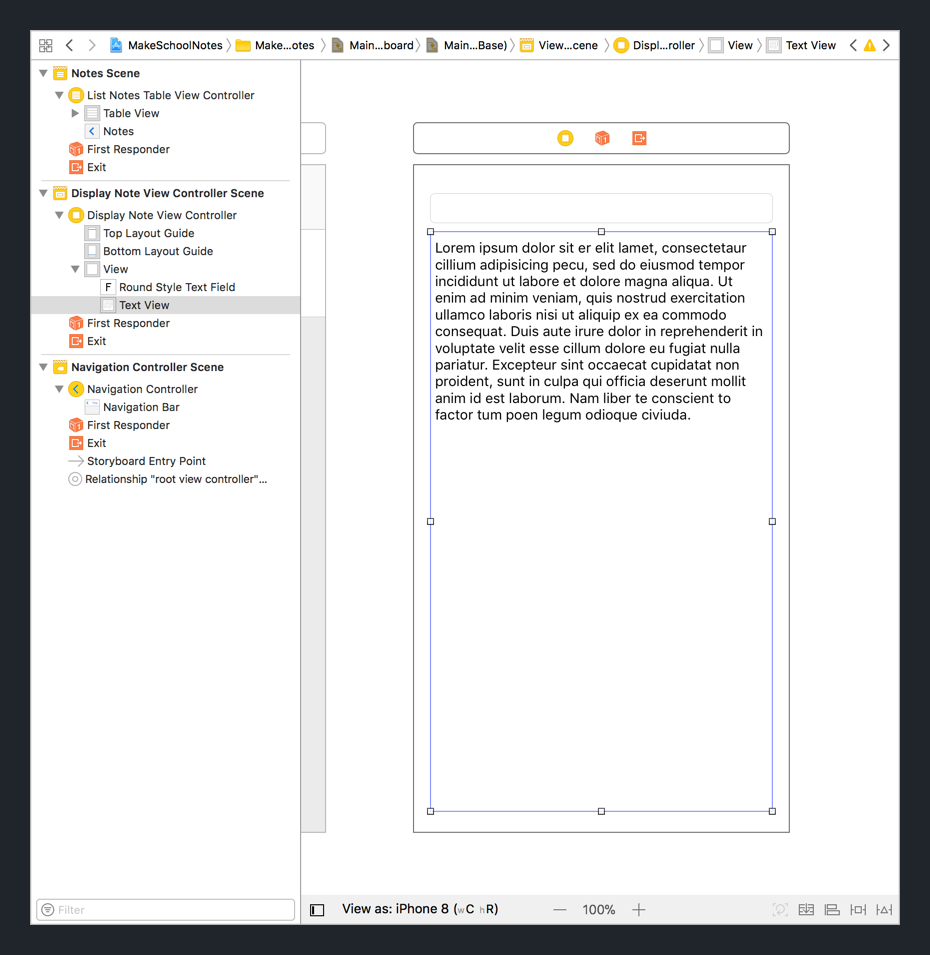
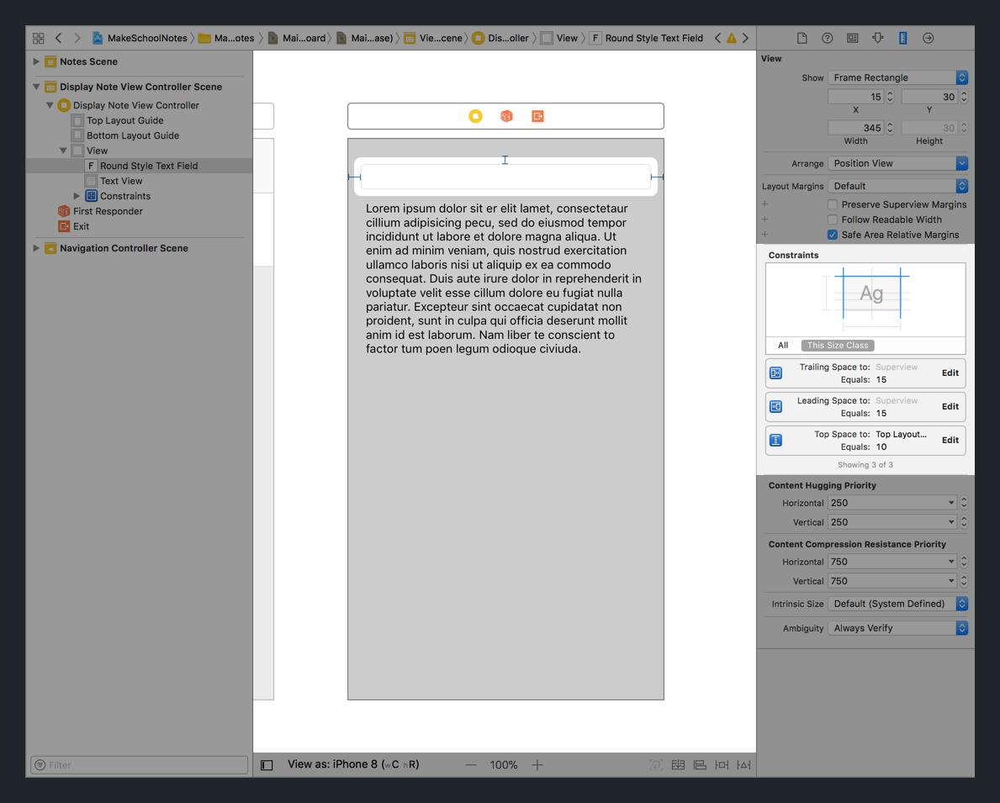
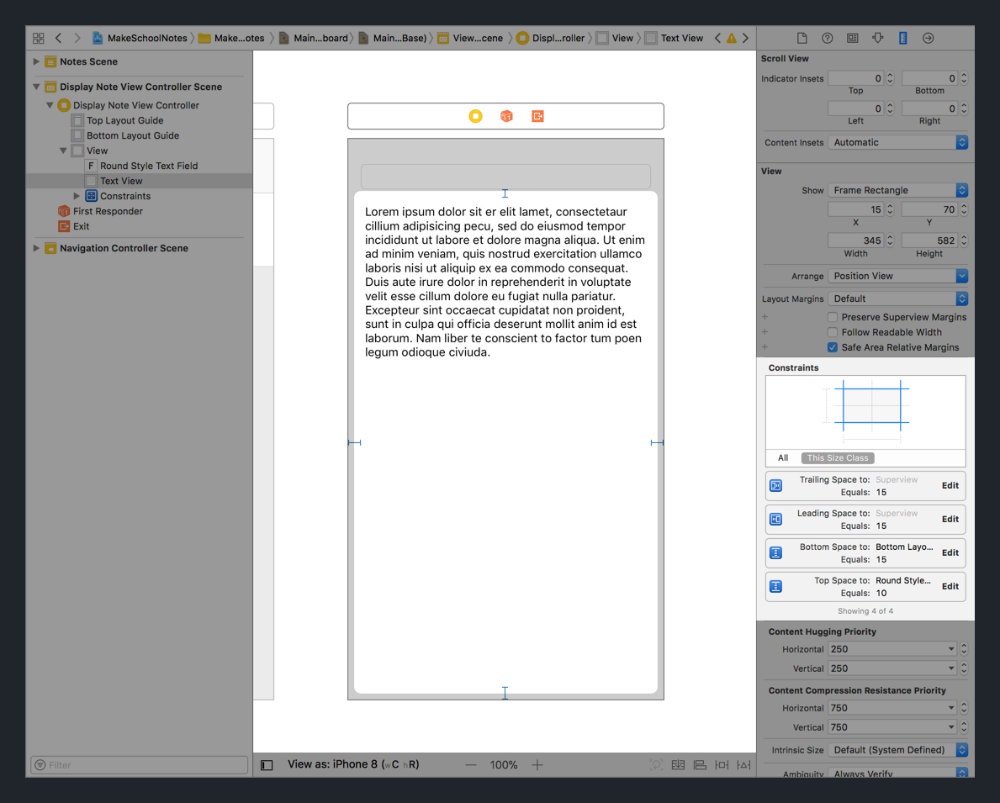
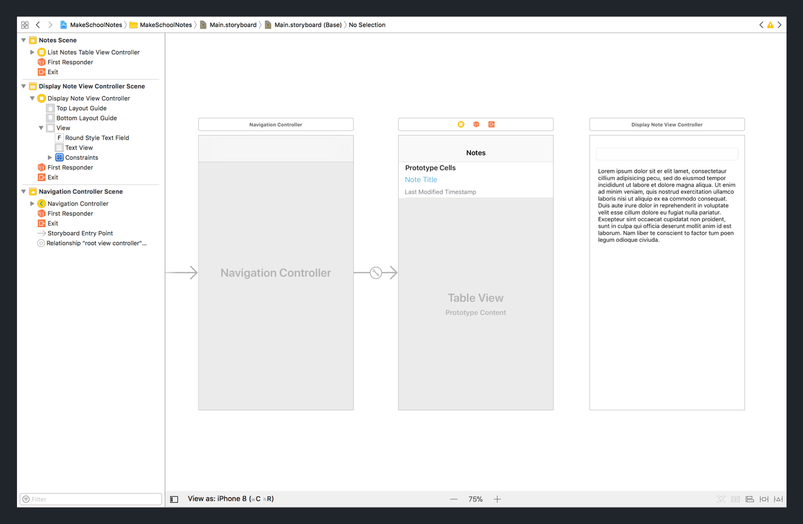

In our _Notes_ app, when a user taps on a note cell in our table view controller, we want our navigation controller to _push_ our `DisplayNoteViewController` on to the top of the navigation stack.

In order for us to set this functionality up, first we'll need to set up our new `DisplayNoteViewController`. Let's get started by creating a new view controller object in our storyboard.

> [action]
In `Main.storyboard`, create a new view controller:
>
1. Drag a view controller from the _Object Library_ into your storyboard. Position it on the right-side of your table view controller.
1. Select your new view controller.
1. With the view controller selected, navigate to the _Identity Inspector_ in the _Utilities area_.
1. In the _Class_ field, set the view controller's custom class to `DisplayNoteViewController`. Auto-complete should help you select the correct class.
>

# Displaying and Editing

Next, we'll need to create our UI layout for `DisplayNoteViewController`. Our view controller will contain the note's title and a body for each note's content. The user should be able to edit the title and content of the note.

To provide this functionality, we'll use two `UIKit` objects: the text field and text view.

We've already used a text field in our tip calculator app. In this app, we'll use the `UITextField` to edit and display the note's title.

As for the note's content, we'll need to introduce a new class we haven't used before: the `UITextView`. A text view provides an easy way to display and edit multiple lines of text.

Let's add both to our `DisplayNoteViewController`.

> [action]
In `Main.storyboard`, add a text field and text view to the `DisplayNoteViewController`:
>
1. Drag a text field from the _Object Library_ to the top of your storyboard view controller. Make sure there's a little space between the top of the view controller and your text field. This will be important for setting up our _auto-layout_ constraints next.
1. Right under your text field, drag a text view from the _Object Library_ and position it's frame so that it roughly covers the remaining view.
>

<!-- break -->

> [info]
Check that you've left some space between the top of the view controller and your text field. This will be important for setting up our _auto-layout_ constraints next.

## Adding Constraints

Let's add our _auto-layout_ constraints to both of our new views.

> [action]
In `Main.storyboard`, add the following constraints to the text field:
>
- (Text Field) Top Edge 10pts from _Safe Area_ Top Edge
- (Text Field) Leading Edge 15pts from _Safe Area_ Leading Edge
- (Text Field) Trailing Edge 15pts from _Safe Area_ Trailing Edge
>

Next, let's do the same for our text view.

> [action]
In `Main.storyboard`, add the following constraints to the text view:
>
- (Text View) Top Edge 10pts from Text Field Top Edge
- (Text View) Leading Edge 15pts from _Safe Area_ Leading Edge
- (Text View) Trailing Edge 15pts from _Safe Area_ Trailing Edge
- (Text View) Bottom Edge 15pts from _Safe Area_ Bottom Edge
>

That's it! We've added our constraints for our `DisplayNoteViewController` subviews. You're getting pretty good at this...

## Checkpoint

We've created a new view controller in storyboard, connected it's custom class to our Swift source file, added it's subviews and finally implemented each subview's _auto-layout_ constraints.

Because our new view controller isn't yet connected to our `UINavigationController`, there's no way for us to check our progress other than comparing storyboards.

Your storyboard should now look like the following:

We'll setup our navigation controller to access our `DisplayNoteViewController` using segues in the next section. Onwards!
