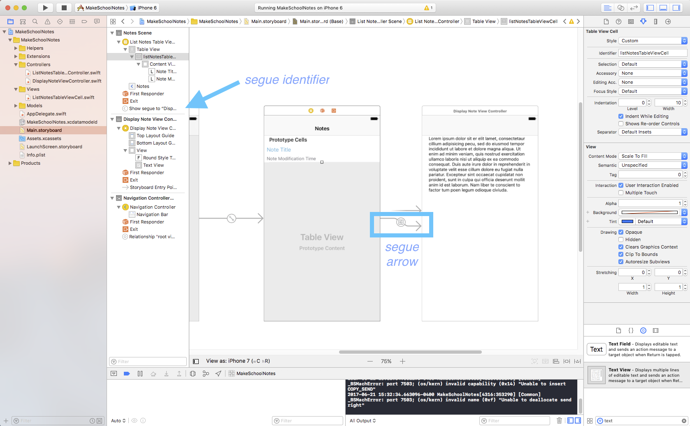
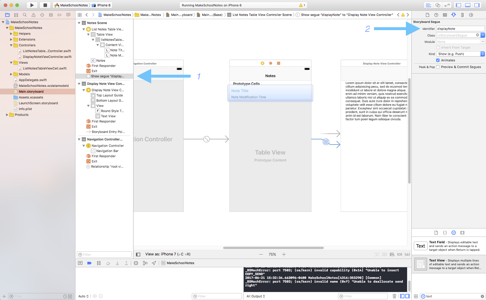
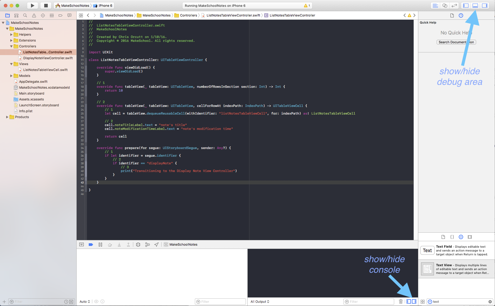
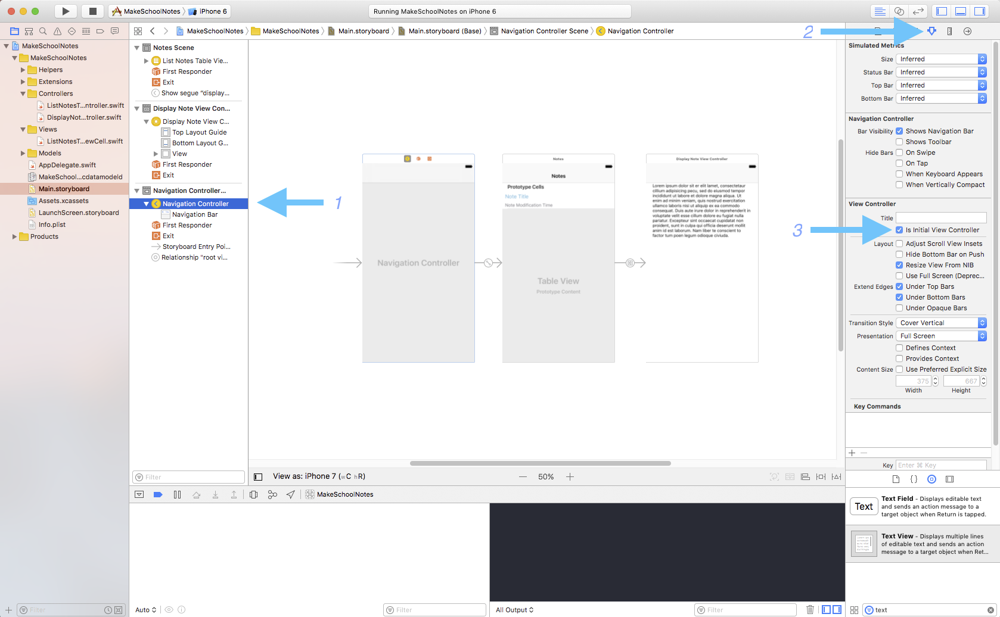

Now that we have our view controllers set up, let's add the functionality that will allow us to transition between view controllers!

To transition to new view in iOS we use *segues* (pronounced seg-way). For Make School Notes, when a user taps a table view cell in the List Notes Table View Controller we want to trigger a segue to our Display Note View Controller Screen. Segues can be created programmatically, but they can also be created in storyboards, which is how we're going to do it.

> [action]
***Control-click*** starting on the *listNotesTableViewCell* and drag to the *Display Note View Controller*, select *show* from underneath the *Selection Segue* options.
>

Notice that when we added the segue an arrow appeared pointing from our *List Notes Table View Controller* to our *Display Note View Controller* and that a new segue entry appeared in our Document Outline. We can click either of the two to view the segue's attributes.

#Segue Identifiers

Segue identifiers are used to uniquely identify segues. We can set a segue's identifier in the Attributes inspector.

> [action]
Set the identifier of the segue that we created above to "displayNote".
>

#The prepareForSegue() method

When a segue is triggered, but before the segue actually happens, the system can notify us by calling a method called `prepareForSegue()`. This method doesn't actually perform the segue, and we will never call it ourselves. Instead, it's a way for us to be told that a segue is about to happen, so that we can do some set up work before the next view is displayed.

> [action]
Add the following method to the List Notes Table View Controller:
>
    override func prepare(for segue: UIStoryboardSegue, sender: Any?) {
      // 1
      if let identifier = segue.identifier {
        // 2
        if identifier == "displayNote" {
          // 3
          print("Transitioning to the Display Note View Controller")
        }
      }
    }
>

In the code above, we are:

1. Storing the identifier of the segue that was triggered into a local variable called `identifier`.
2. Checking to see if the "displayNote" segue was triggered.
3. Printing a message to the *console*.

All `print()` statements are printed to the console. The console can be opened by:

1. Showing the *Debug area*
2. Showing the console

#Running the App!

> [action]
Before running your app, set the navigation controller as the *Initial View Controller*.

Now when we tap a table view cell we should transition to the *Display Note View Controller* screen and a message should be printed to the console! Also, note that the navigation controller we added earlier is providing the back button functionality. Also, if you click either of the text boxes, a keyboard shows up and you can begin editing, although the changes won't be saved just yet. We'll add the note saving functionality in a later. =]

>[info]
>###On this page, you should have:
>
>1. Created a segue from the listNotesTableViewCell to the Display Note View Controller.
>2. Added the identifier *displayNote* to the segue
>3. Added the `prepareForSegue()` method to the List Notes Table View Controller.
>4. Made the navigation controller the initial view controller.
>5. Run and tested your app
