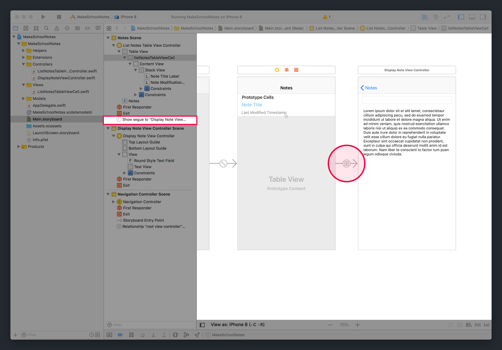
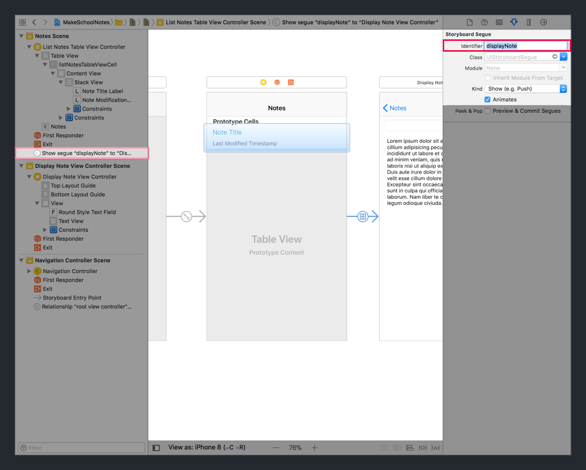

With our new `DisplayNoteViewController` set up, we can implement the functionality for our `UINavigationController` to navigate between view controllers.

A navigation controller uses _segues_ (pronounced seg-way) to navigate from one view controller to another. A _segue_ allows us to _push_ and _pop_ view controllers on and off the navigation stack.

# Creating A Segue

In our _Notes_ app, when a user taps on a `ListNotesTableViewCell` in our table view controller, we want to trigger a segue to our `DisplayNoteViewController`.

> [info]
Segues can be triggered programmatically and in storyboard with _Interface Builder_. This tutorial will focus on creating segues in storyboard.

<!-- break -->

> [action]
In `Main.storyboard`, create a segue that's triggered when a user taps on a notes cell:
>

>
Step-by-step:
>
1. Select the storyboard cell in your table view controller.
1. With your notes cell selected, control-click and drag to the `DisplayNoteViewController`.
1. In the popup, select a _Selection Segue_ of `Show` to create your new segue.

After creating your new segue, you'll see a segue arrow connecting the table view controller and `DisplayNoteViewController`. You can also see this segue in the _Document Outline_.



You'll also notice that since we setup our text field with _auto-layout_ constraints using our _Safe Area_, when our `UINavigationController` added a navigation bar to our `DisplayNoteViewController`, our subviews re-positioned themselves automatically. This is because the _Safe Area_ now registers it's top edge as the bottom of the navigation bar. Neat!

## Adding A Segue Identifier

Segue identifiers, similar to the table view cell identifiers we previously used, allow us to uniquely identify a storyboard segue in our Swift code.

Let's add a segue identifier to our new segue.

> [action]
Add a segue identifier to the segue between our table view controller and display notes view controller:
>

>
Step-by-step:
>
1. Select the segue by clicking on it.
1. With the segue selected, navigate to the _Attributes Inspector_ in the _Utilities area_.
1. Set the _Identifier_ field to `displayNote`.

Now, we're able to reference this specific segue in our code using it's new identifier that we've just setup.

# Preparing For Segues

Right before a segue is completed, we can use a built-in `UIViewController` method named `prepare(for:sender:)` to execute code just before the new view controller is _pushed_ on to the navigation stack.

> [info]
You should never called `prepare(for:sender:)` yourself. Each `UIViewController` will automatically notify you with the `prepare(for:sender:)` when segues are about to happen.

This allows us to, as the name suggests, prepare for a segue. This will be especially useful for passing data from one view controller to the next.

Let's test it out!

> [action]
Open `ListNotesTableViewController` with your _Project Navigator_, and add the following code below your table view data source methods:
>
```
override func prepare(for segue: UIStoryboardSegue, sender: Any?) {
    // 1
    guard let identifier = segue.identifier else { return }
>
    // 2
    if identifier == "displayNote" {
        print("Transitioning to the Display Note View Controller")
    }
}
```
>
In the code above:
>
1. Check that the segue has a identifier.
1. If so, check if the identifier is equal to `displayNote`. If yes, add a print statement to our debug console.

## Running the App

In this section, we setup a segue for when a user taps on a note cell in our `ListNotesTableViewController`. We've also implemented code that override our table view controller's `prepare(for:sender:)` and print to the debug console each time the segue is triggered.

Let's test that our new segue works!

> [action]
Build and run the app. In the table view controller, click on a note cell. To _pop_ off the `DisplayNoteViewController` off the navigation stack, we can tap the back button. Navigate back and forth between the two view controllers and check that `prepare(for:sender:)` is printing to the debug console correctly.
>


If everything looks correct, let's _segue_ on to the next section and learn about how to add new bar button items to our navigation bar.
