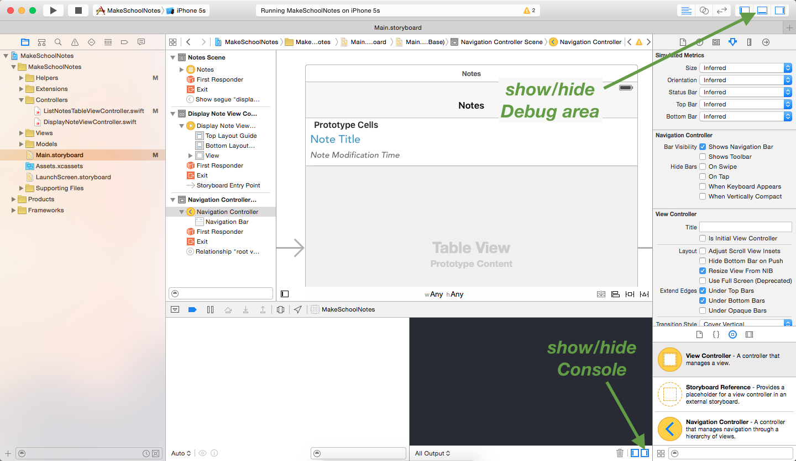

Now that we have our view controllers set up, let's add the functionality that allows us to transition between view controllers!

# Introduction to Segues

To transition to new screens in iOS we use what are called *segues* (pronounced seg-way). For Make School Notes, when a user taps a table view cell we want to trigger a *segue* to our *Display Note View Controller Screen*. To set up this segue all we have to do is `Control-click` from our *listNotesTableViewCell* in our Document Outline to our *Display Note View Controller* in our storyboard.

> [action]
`Control-click` from the *listNotesTableViewCell* to the *Display Note View Controller*, select *show* from underneath the *Selection Segue* options.
>
<video width="100%" controls>
    <source src="https://s3.amazonaws.com/mgwu-misc/Make+School+Notes/segue.mov" type="video/mp4">
</video>

Notice that when we added the segue an arrow appeared pointing from our *List Notes Table View Controller* to our *Display Note View Controller* and that a new segue entry appeared in our Document Outline. We can click either of the two to view the segue's attributes.

 

## Segue Identifiers

Segue identifiers are used to uniquely identify segues. We can set a segue's identifier in the Attributes inspector.

> action
Set the identifier of the segue that we created above to "displayNote".
>

## The prepareForSegue() method

When a segue is triggered, before the app actually transitions from one view controller to another, it calls a method called `prepareForSegue()`. The `prepareForSegue()` method is used when we want to take a specific action when a specific segue is triggered.

> [action]
Add the following method to the List Notes View Controller:
>
    override func prepareForSegue(segue: UIStoryboardSegue, sender: AnyObject?) {
      // 1
      if let identifier = segue.identifier {
        // 2
        if identifier == "displayNote" {
          // 3
          print("Transitioning to the Display Note View Controller")
        }
      }
    }
>

In the code above, we are:

1. Storing the identifier of the segue that was triggered into a local variable called `identifier`.
2. Checking to see if the "displayNote" segue was triggered.
3. Printing a message to the *console*.

All `print()` statements are printed to the console. The console can be opened by:

1. Showing the *Debug area*
2. Showing the console

## Running the App!

> [action]
Before running your app, set the navigation controller as the *Initial View Controller*.

Now when we tap a table view cell we should transition to the *Display Note View Controller* screen and a message should be printed to the console! Also, note that the navigation controller we added earlier is providing the back button functionality and that if we click either of the text boxes, a keyboard shows up and we can begin editing, although our changes won't be saved just yet. We'll add the note saving functionality in a later tutorial. =]

<video width="100%" controls>
    <source src="https://s3.amazonaws.com/mgwu-misc/Make+School+Notes/P05-complete.mov" type="video/mp4">
</video>
