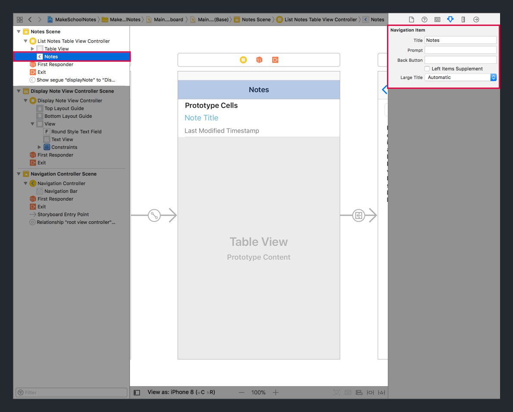
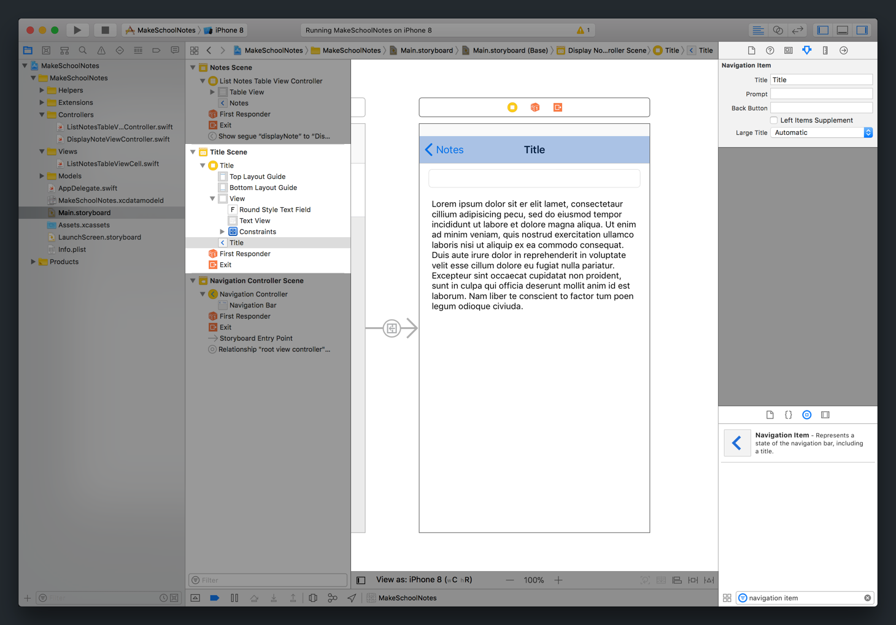
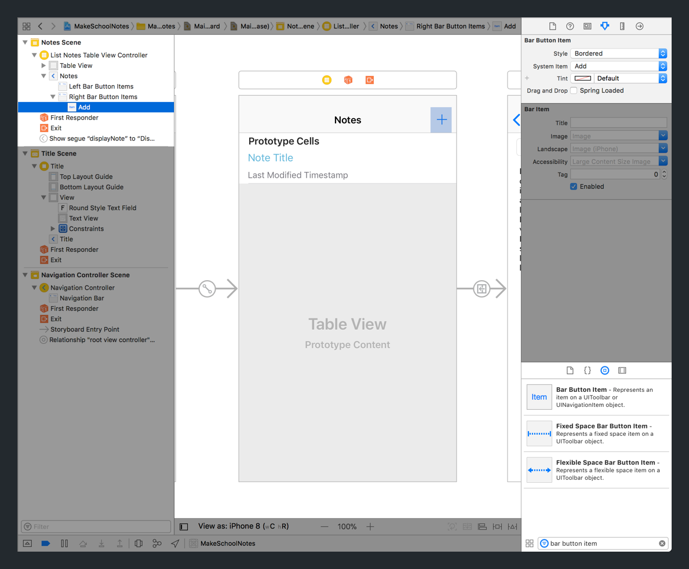
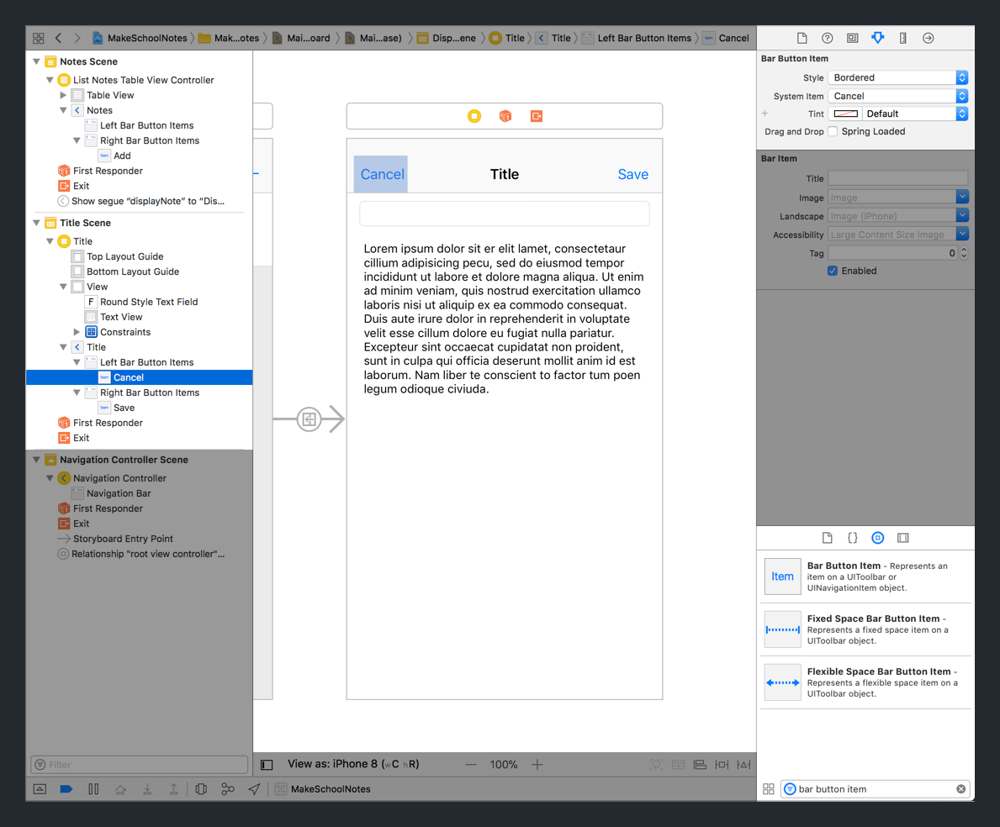
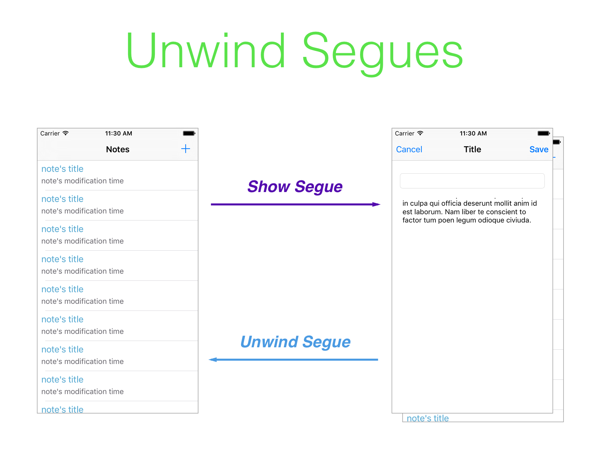
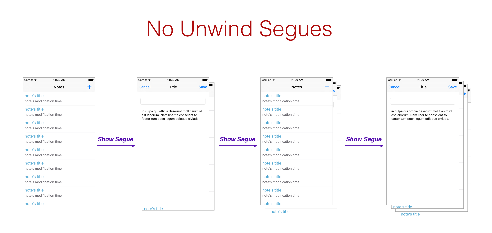

In our _Notes_ app, a user will need to create, edit and/or discard notes. To do so, we'll need to introduce bar button items.

`UIBarButtonItem` allows us to add additional buttons in our navigation bar.


To support the creating, editing, and discarding actions, we'll new to implement 3 new bar button items.

First, in our `ListNotesTableViewController`, we'll need to add a **create** bar button item for creating new notes.

Next, in our `DisplayNoteViewController`, we'll add a **save** bar button item for editing existing notes and a **cancel** button for either discarding unintended changes or _popping_ the view controller off the navigation stack.

## Navigation Items

To add `UIBarButtonItem` to a navigation bar in storyboard, the navigation bar must first have a _Navigation Item_.

If you open `Main.storyboard`, you can see that our `ListNotesTableViewController` has a _Navigation Item_ in the _Document Outline_.



Conversely, if you look at our `DisplayNoteViewController` navigation bar, it doesn't have a _Navigation Item_ yet. Let's change that now.

> [action]
In `Main.storyboard`, add a _Navigation Item_ to your `DisplayNoteViewController` navigation bar:
>


Both of our storyboard view controllers should now have _Navigation Items_. Next, we'll add our create, save, and cancel `UIBarButtonItem` views.

# Adding Bar Button Items

Let's start by creating a new _Create Note_ bar button item in our `ListNotesTableViewController`.

> [action]
In `Main.storyboard`, implement a new bar button item for your table view controller:
>
1. Drag a `UIBarButtonItem` from your _Object Library_ to the top right side of your `ListNotesTableViewController` navigation bar.
1. Select the `UIBarButtonItem`.
1. With the bar button item selected, navigate to the _Attributes Inspector_ in the _Utilities area_.
1. Change the _System Item_ dropdown from `Custom` to `Add`.
>


One bar button item down, two more to go!

Repeat the same process above to add a save and cancel bar button item to your `DisplayNoteViewController`.

> [action]
In `Main.storyboard`, implement both save and cancel buttons to your `DisplayNoteViewController`.
>


We've successfully added 3 new bar button items. However, if you run the app right now, tapping on them do anything.

Next, we'll need to configure each bar button item so that tapping on it performs it's expected behavior.

# Bar Button Item Segues

Each time the user taps on one of our bar button items, we want to either _push_ or _pop_ off of our navigation stack.

In the case of our _Create Note_ button, when a user taps on the `UIBarButtonItem`, the `ListNotesTableViewController` should segue to the `DisplayNoteViewController`.

Let's implement that now!

> [action]
In `Main.storyboard`, create a segue when the user taps the _Create Note_ bar button item and set it's identifier:
>

>
Step-by-step:
>
1. Select the _Create Note_ bar button item in the navigation bar of your table view controller. It should look like a plus (+) button.
1. Hold control and click-drag from the _Create Note_ bar button item to the `DisplayNoteViewController`.
1. In the popup, select a _Action Segue_ of `Show` to create your new segue.
>
Next, let's set our new segue's identifier:
>
1. Select the new segue that appears between your `ListNotesTableViewController` and `DisplayNoteViewController`. When the correct segue is selected, you should see the _Create Note_ bar button item highlighted.
1. With the segue selected, navigate to the _Attributes Inspector_ in the _Utilities area_.
1. Set the _Identifier_ field to `addNote`.

With our new segue identifier, we can update `prepare(for:sender:)` to notify us before the segue triggered by the _Create Note_ bar button item completes.

> [action]
Open `ListNotesTableViewController.swift` and update the method `prepare(for:sender:)` to the following:
>
```
override func prepare(for segue: UIStoryboardSegue, sender: Any?) {
    guard let identifier = segue.identifier else { return }
>
    switch identifier {
    case "displayNote":
        print("note cell tapped")
>
    case "addNote":
        print("create note bar button item tapped")
>
    default:
        print("unexpected segue identifier")
    }
}
```
>
In the code above, we update our if-statement to a switch-statement that checks for each segue identifier.
>
For each identifier, the switch-statement outputs a corresponding print statement to the debug console.

Now, if we build and run our app, tapping on the _Create Note_ bar button item will segue to the `DisplayNoteViewController` and output a print statement to the debug console.

Next, we'll look at how to implement segues for our `DisplayNoteViewController`.

# Unwind Segues

Both the save and cancel bar button items will need to _pop_ the `DisplayNoteViewController` off the navigation stack.

Because these segues are _pops_, instead of _pushes_, we'll need to implement a special type of segue known as a _unwind segue_.

_Unwind segues_ are used to _pop_ view controllers off the navigation stack. In other words, they're used to navigate back to previous view controllers on the navigation stack.

For instance, when a user taps the _Create Note_ bar button item, a segue is triggered and our navigation controller _pushes_ an instance of `DisplayNoteViewController` to the top of our navigation stack. Then, if we tap the cancel bar button item, we can use an _unwind segue_ to navigate back from the `DisplayNoteViewController` to the table view controller again.



## Segue Memory Leaks

When navigating between multiple view controllers, be careful about creating memory leaks!

When triggering _show_ segues, a new instance of a view controller is _pushed_ onto the navigation stack. If we were to only use _show_ segues to navigate between view controllers, we would be continuously creating and adding new instances of view controllers onto the navigation stack. If unbounded, this could cause our app to run out of memory, potentially crashing our app!

In the image below, we only use segues to _push_ new instances of our two view controllers onto the navigation stack. After a few segues, our navigation stack has multiple instances of both our `ListNotesTableViewController` and `DisplayNoteViewController`.



Bad! This is why we must be aware of our navigation stack and use _unwind segues_ to navigate back and forth between existing instances of view controllers.

## Implementing Unwind Segues

To make sure we don't keep adding new instances with _show_ segues, let's implement our _unwind segues_ for our `DisplayNoteViewController`.

Creating a _unwind segue_ requires two steps (in order):

1. Create a special `@IBAction` method in the destination view controller that we're trying to unwind to. In our case, we'll put this method in our table view controller.
1. Create a _unwind segue_ in our storyboard.

It's important to follow these steps in order. If we don't add our special `@IBAction` method in the destination view controller that we're unwinding to, we won't be able to create our _unwind segue_ in storyboard.

Let's start with step 1. We want to unwind from `DisplayNoteViewController` back to `ListNotesTableViewController`. For us, our destination view controller will be `ListNotesTableViewController`.

> [action]
In `ListNotesTableViewController`, add the following `@IBAction`:
>
```
@IBAction func unwindWithSegue(_ segue: UIStoryboardSegue) {
>
}
```
>
We don't need to add any code within our unwind `IBAction`. Xcode just needs to register the function definition for us to create our _unwind segue_ in storyboard.

Next, we'll follow step 2: create our _unwind segues_ for both cancel and save bar button items in storyboard. Let's start with our cancel bar button item.

> [action]
In `Main.storyboard`, create a _unwind segue_ for your cancel bar button item and give it a identifier:
>

>
Step-by-step:
>
1. Select your cancel bar button item.
1. Hold down control and click-drag from the cancel back button item to the orange exit icon on the top bar above your view controller.
1. In the popup, selected the `IBAction` you created in step 1.
>
Next, let's give our _unwind segue_ an identifier:
>
1. Select your _unwind segue_. You won't see it appear in storyboard, so you'll need to select it using your _Document Outline_.
1. With your segue selected, navigate to the _Attributes Inspector_ in the _Utilities area_.
1. Set the _Identifier_ field to `cancel`.

Next, we'll repeat the same steps for our save bar button item's _unwind segue_. We don't need to repeat step 1 since our `ListNotesTableViewController` already has a `IBAction` for _unwind segues_.

> [challenge]
Repeat step 2 for our `DisplayNoteViewController` save bar button item. Set the new _unwind segue_ to have an identifier of `save`.
>
If you get stuck, refer back to the steps on how we previously created a _unwind segue_ for our cancel bar button item.

When you're done, we can add code to our `DisplayNoteViewController` to notify us before a _unwind segue_ completes. In addition, we can use our new identifiers to identify which segue is being triggered.

> [action]
In `DisplayNoteViewController.swift`, add the following code to your view controller:
>
```
override func prepare(for segue: UIStoryboardSegue, sender: Any?) {
    guard let identifier = segue.identifier else { return }
>    
    switch identifier {
    case "save":
        print("save bar button item tapped")
>        
    case "cancel":
        print("cancel bar button item tapped")
>        
    default:
        print("unexpected segue identifier")
    }
}
```
>
In the code above, we use `prepare(for:sender:)` to notify us if an _unwind segue_ from one of our bar button items is being triggered. The method `prepare(for:sender:)` is especially useful because we're able to prepare for navigating both back and forth between other view controllers.

## Running the App

In this section, we setup new segues for our bar button items. Let's test that each of our new bar button items work!

> [action]
Build and run the app. In the table view controller, click on the _Create Note_ bar button item. Next try the cancel and save buttons. Make sure each bar button item segues and outputs the correct print statement to the debug console.
>


Next, we'll look at how to start implementing our logic for our notes app!
