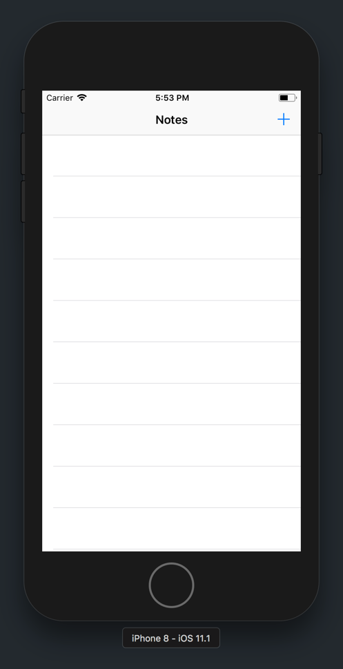

Up to this point, we've set up our app UI and navigation between our two view controllers. In this section, we'll create a _data model_ to represent and store our note data.

As you continue to build apps, you'll need a way to represent objects to store data. Common examples of these objects might include a person, an animal, or even a note!

For each of these objects, we want to store certain details (also referred to as data). In addition, each object may be able to perform certain actions.

For the example of a person, we might want to store details about their name, birthdate and height. We could define a Swift class named `Person` with the following properties:

```
class Person {

  // MARK: - Properties

  let name = "Daniel"
  let birthdate = Date()
  var height = 74

}
```

In addition, it's common for objects to perform certain actions. Following the example of a person, each person might be able to walk, run and jump.

We can define a methods for our `Person` for the following actions:

```
class Person {

  // MARK: - Properties

  let name = "Daniel"
  let birthdate = Date()
  var height = 74

  // MARK: - Methods

  func walk() {
    ...
  }

  func run() {
    ...
  }

  func jump() {
    ...
  }

}
```

For our _Notes_ app, we'll need to create a new object to represent and store our note data. But first, we'll need to create a new Swift file to hold our new class.

# Creating A Swift File

Creating a new Swift file is easy. In fact, you may have already done it before. Let's create a new Swift file named `Notes.swift`.

> [action]
In your _Project Navigator_, create a new, empty Swift file:
>

>
Step-by-step:
>
1. Right click in your empty _Models_ group.
1. In the contextual menu popup, click _New File..._
1. Make sure you select the Swift template. This will generate a new, empty Swift source file.
1. Save your new file as `Notes.swift`.

# Create Our Data Model

Our note data model will need a title, it's last modified time and it's content.

> [action]
In `Notes.swift`, create the following class:
>
```
class Note {
>
    // MARK: - Properties
>
    var title = ""
    var content = ""
    var modificationTime = Date()
}
```

## Using Our New Model

Our table view controller currently uses hard-coded values to populate the labels for each table view cell. Let's update `ListNotesTableViewController` to use our new data model.

First, we'll need to create an array of notes for our `ListNotesTableViewController` to display.

> [action]
In `ListNotesTableViewController.swift`, add the following array to the top of your class:
>
```
class ListNotesTableViewController: UITableViewController {
>
    // MARK: - Properties
>
    var notes = [Note]()
>        
    override func viewDidLoad() {
        super.viewDidLoad()
    }
>
    // ...
>
}
```
>
In the code above, we've added a empty `Notes` array to contain the user's notes.

Next, we'll need to update our table view data source methods to display cells based on our new `notes` array.

> [action]
In `ListNotesTableViewController.swift`, update both table view data source methods to the following:
>
```
override func tableView(_ tableView: UITableView, numberOfRowsInSection section: Int) -> Int {
    // 1
    return notes.count
}
>
override func tableView(_ tableView: UITableView, cellForRowAt indexPath: IndexPath) -> UITableViewCell {
    let cell = tableView.dequeueReusableCell(withIdentifier: "listNotesTableViewCell", for: indexPath) as! ListNotesTableViewCell
>    
    // 2
    let note = notes[indexPath.row]
    cell.noteTitleLabel.text = note.title
    // 3
    cell.noteModificationTimeLabel.text = note.modificationTime.convertToString()
>    
    return cell
}
```
>
In the code above:
>
1. Dynamically return the number of notes in the `notes` array.
1. Retrieve the correct note based on the index path row and set the note cell's labels with the corresponding data.
1. We use the method `convertToString()` that was included in our project to convert our modification time from type `Date` to `String`.

## Running the App

Let's stop here to run and test our app. If you build and run, you should see the following:



What happened to our notes?

That's right. If you remember, we're now using our `notes` array in our `ListNotesTableViewController` to display our notes. Since our array is initialized to be empty, our table view correctly doesn't display any cell.

Next, we've implement the functionality for creating new notes with our _Create Note_ bar button item!
