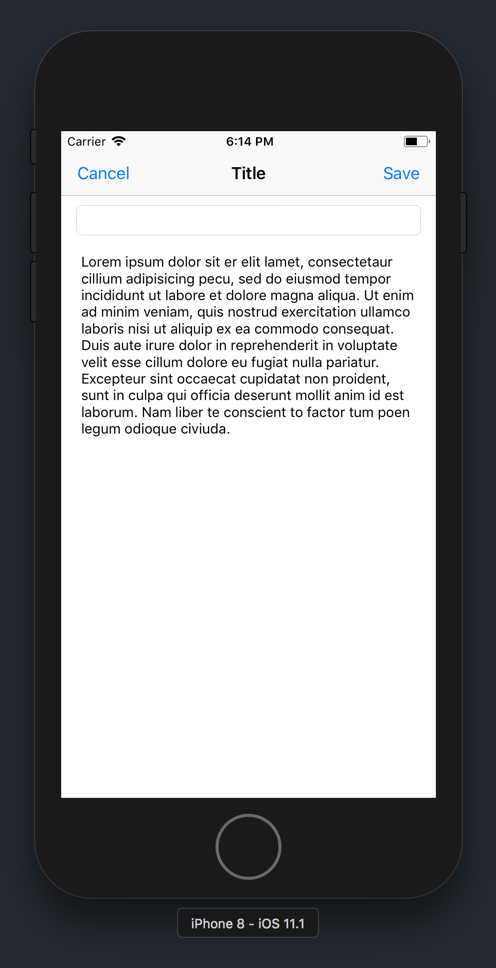
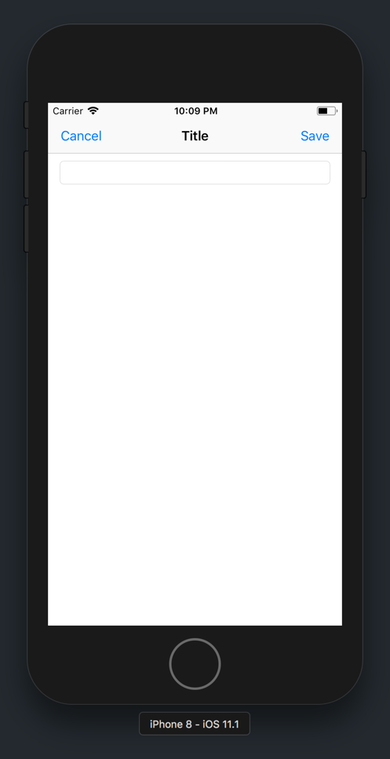

With our data model setup, we can begin adding our note functionality! But first, we'll need to do some initial setup.

# View Controller Setup

We'll need to create an `IBOutlet` for our text field and text view respectively. We'll need these `IBOutlet` properties to reference our text field and text view in our code.

Here we go again...

> [challenge]
Using the _Assistant Editor_, create an `IBOutlet` for the text field and text view in `DisplayNoteViewController`.
>
1. Name the text field's `IBOutlet` as `titleTextField`.
1. Name the text view's `IBOutlet` as `contentTextView`.

Easy enough.

Next, let's use the `IBOutlet` connections we created to remove the initial filler text in our text view.

## Removing Lorem Ipsum

Right now, if you tap the _Create Note_ bar button item, you'll see the following:



As you can see, our text view contains a bunch of lorem ipsum which is filler text.

That's not right... if a user wants to create a new note, the text view should be empty so that the user can begin taking notes.

Let's fix that now.

> [action]
In `DisplayNoteViewController`, add the following code right below your `viewDidLoad` method:
>
```
override func viewWillAppear(_ animated: Bool) {
    super.viewWillAppear(animated)
>    
    titleTextField.text = ""
    contentTextView.text = ""
}
```
>
The method `viewWillAppear(_:)` is a view controller lifecycle method that is called right before a view is about to appear on the screen.
>
In the code above, we set the text property of both our text field and text view to an empty string. This removes the current lorem ipsum text that we saw previously from our text view.

# Create a New Note

With out setup complete, we're ready to create our first note.

> [action]
In `DisplayNoteViewController`, update the following code to `prepare(for:sender:)`:
>
```
override func prepare(for segue: UIStoryboardSegue, sender: Any?) {
    guard let identifier = segue.identifier else { return }
>
    switch identifier {
    case "save":
        // 1
        let note = Note()
>
        // 2
        note.title = titleTextField.text ?? ""
        note.content = contentTextView.text ?? ""
>
        // 3
        note.modificationTime = Date()
>
    case "cancel":
        print("cancel bar button item tapped")
>
    default:
        print("unexpected segue identifier")
    }
}
```
>
In the code above, we update our `save` switch-case to do the following:
>
1. Initialize a new `Note` object.
1. Set the new note's title and content to the corresponding text field and text view text values. If either value is `nil`, we provide an empty string as the default value using the nil coalescing operation (??).
1. Set the new note's last modified time to the current date and time.

## Saving The Note

We've created a new note, but it hasn't been saved yet. To save our new note, we want to add it to our `notes` array in our `ListNotesTableViewController`. To do so, we'll need to use segues to pass data between view controllers.

> [action]
In `DisplayNoteViewController`, update the following code to `prepare(for:sender:)`:
>
```
override func prepare(for segue: UIStoryboardSegue, sender: Any?) {
    guard let identifier = segue.identifier else { return }
>
    switch identifier {
    case "save":
        let note = Note()
        note.title = titleTextField.text ?? ""
        note.content = contentTextView.text ?? ""
        note.modificationTime = Date()
>
        // 1
        let destination = segue.destination as! ListNotesTableViewController
        // 2
        destination.notes.append(note)
>
    case "cancel":
        print("cancel bar button item tapped")
>
    default:
        print("unexpected segue identifier")
    }
}
```
>
Step-by-step:
>
1. Each segue is a link between two view controllers and provides reference to both the source and destination view controllers. We can use the segue's `destination` property to reference the destination view controller. But, in order to access the destination view controller's properties, we need to type cast the destination view controller to type `ListNotesTableViewController`.
1. With a reference to `ListNotesTableViewController`, we're able to direct append our new note to it's `notes` array.

## Reloading The Table View Data Source

Tapping the save bar button item will now add our newly created note instance to the `ListNotesTableViewController` note array. To finish up, we'll also need to notify our `UITableView` to reload it's data using the `UITableView` method `reloadData()`.

> [info]
Table views don't automatically know when they should update their table view cell UI. When you want to update a table view by adding, modifying or deleting a cell, you need to explicitly tell the table view to reload it's data source.
>
Doing so will cause the table view to re-calculate it's table view cells using it's table view data source methods.

But when should we tell the table view it's data?

We can use property observers! Property observers allow us to write code when a property has been changed.

> [action]
In `ListNotesTableViewController`, change your `notes` array property to the following:
>
```
var notes = [Note]() {
    didSet {
        tableView.reloadData()
    }
}
```
>
In the code above, we add syntax to create a property observer for our `notes` array. As the name suggests, the `didSet` observes the `notes` property. If the property changes the code within the `didSet` block is executed.
>
For us, this is extremely useful for reloading the table view whenever a new note has been added to the `notes` array. Oh you fancy huh?

## Running the App

In this section, we implemented the functionality to add a new note to our `ListNotesTableViewController` notes array. We use `prepare(for:sender:)` to pass data between view controllers and a property observer to update our table view when a new note has been added.

Let's test that everything works!

> [action]
Build and run the app. Create a new note using the _Create Note_ bar button item and then save it. Check that the new note shows up back in the table view controller.
>


We've implemented the functionality for creating new notes, but what happens if we click on an existing note?



We get a blank, empty note! Hmm... something's not right. Let's figure out how to display existing notes in the next section.

> [info]
You also might be wondering, "Why are your notes are reset whenever you re-launch the app?"
>
This is because we haven't set up persistence to save our note data yet. We'll get there soon, but in the mean time, our notes will be delete from memory each time the app is terminated.
