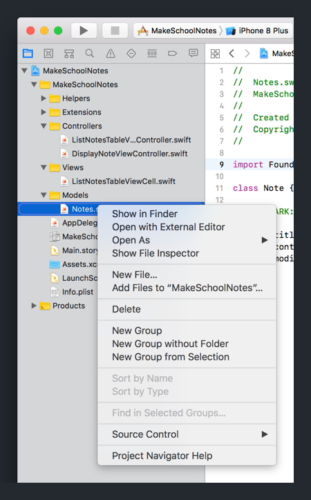
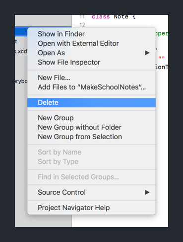
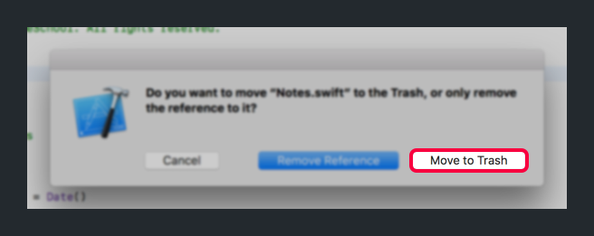
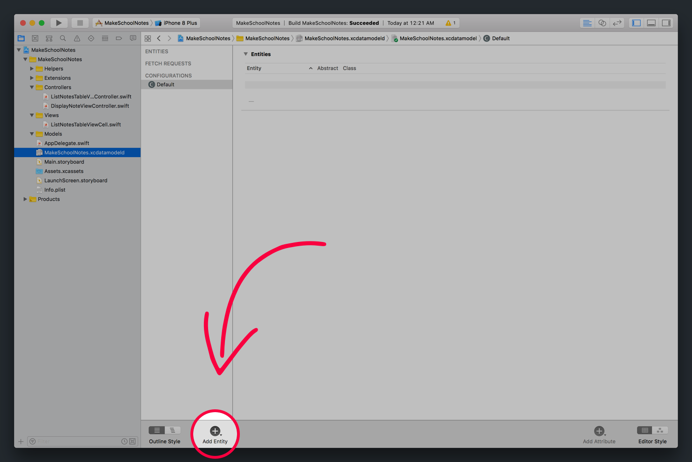
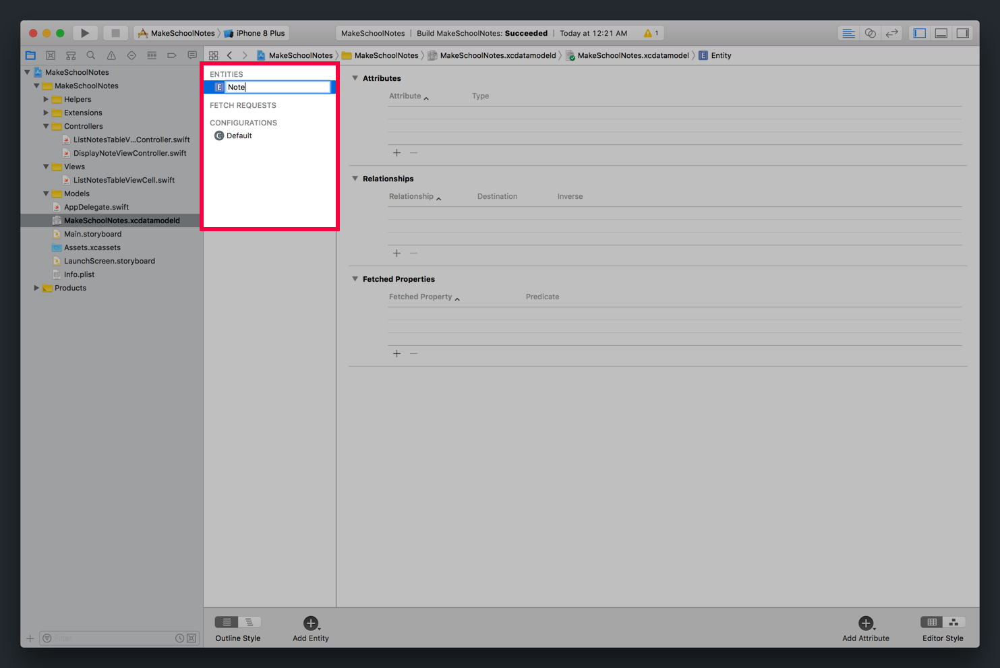
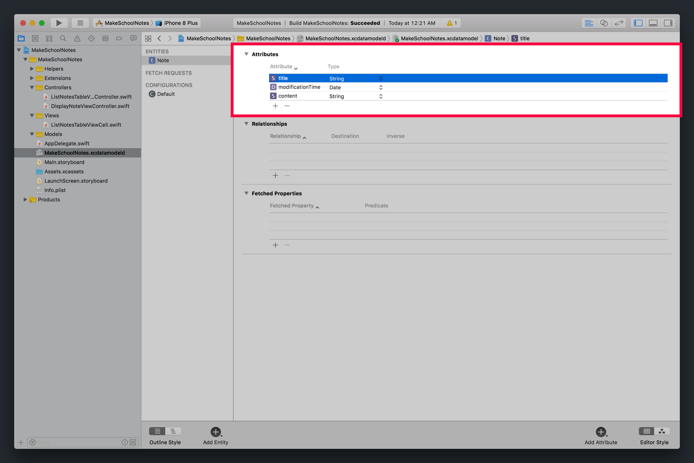
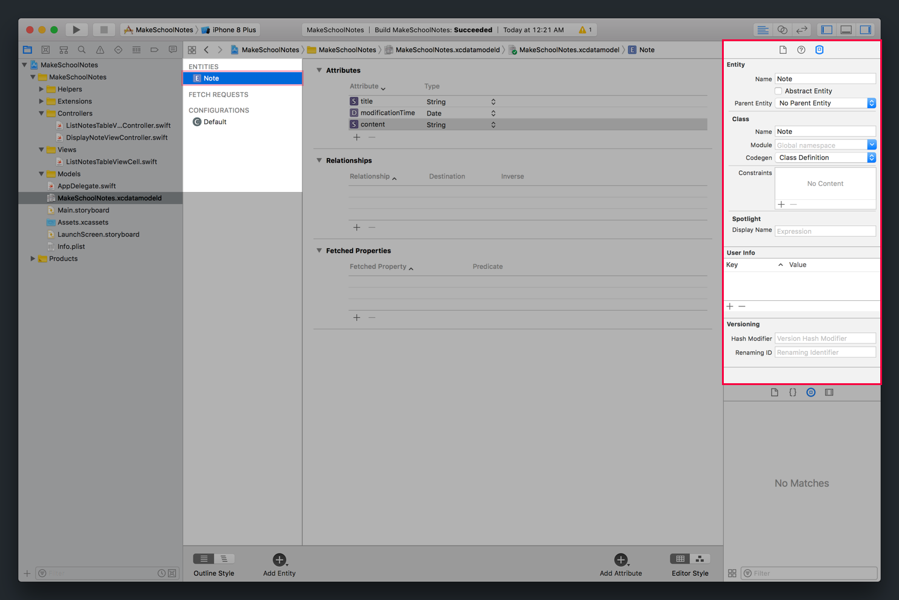
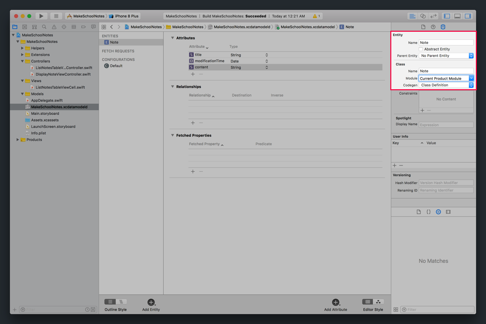

In this section, we'll create a helper object to make interacting with _Core Data_ easier. Our helper object will abstract our _Core Data_ code into easy to use methods that we can use throughout the rest of our project.

Our helper object will need to help us do the following:

- create new notes
- edit (modify) existing notes
- delete notes
- retrieve previously saved notes

## Deleting Our Old Data Model

Since _Core Data_ automatically generates it's own `NSManagedObject` version of a data model, we can get rid of the previous data model that we created.

> [action]
Delete `Note.swift` from your Xcode project:
>
1. Right-click on `Note.swift` in your _Project Navigator_. 
1. In the contextual menu, select _Delete_. 
1. In the next popup, select the option to `Move to Trash`. 

## Create a New Note Entity

Next, we'll need to generate a new data model to replace our old one. To do this, we'll use the `MakeSchoolNotes.xcdatamodeld` provided in your project.

> [action]
Open `MakeSchoolNotes.xcdatamodeld` with your _Project Navigator_, and create a new `NSManagedObject` subclass for your note data:
>
1. On the bottom left of your _Editor_, you should see a button to _Add Entity_. Click this to begin creating your new data model. 
1. In the top left pane, you should see an outline of all of your entities. Double-click on your newly-created entity and change it's name to `Note`. 
1. On the right of the entities outline, you should see a section with the header _Attributes_. Use the plus (+) button at the bottom of the section to create the following 3 new attributes: 
	You should have added the following attributes to your Note entity:
	- _title_ of type `String`
	- _content_ of type `String`
	- _modificationTime_ of type `Date`
1. Next, select your _Note_ entity in the outline.
1. With your _Note_ entity selected, navigate to the _Data Model inspector_ in the _Utilities area_. 
1. In the _Data Model inspector_, set the following attributes: 
	You should have set following fields in your _Data Model inspector_:
	- _Class_: Make sure the value is set as `Note`
	- _Module_: Set from empty to `Current Product Module`

## Bug Fixing

Although we can't see the code in our _Project Navigator_, by creating our _Note_ entity in `MakeSchoolNotes.xcdatamodeld`, Xcode has generated a `Note` model for us.

We'll be using this _Core Data_-generated `Note` model to create, save, display, edit and delete notes.

If you build and run the app right now, you'll notice there's a new error introduce by our new `Note` model. This is because our new `Note` class has a `modificationTime` property of type `Date?`.

Let's fix this real quick:

> [action]
In `ListNotesTableViewController`, update your `tableView(_:cellForRowAt:)` with the following:
>
```
override func tableView(_ tableView: UITableView, cellForRowAt indexPath: IndexPath) -> UITableViewCell {
    let cell = tableView.dequeueReusableCell(withIdentifier: "listNotesTableViewCell", for: indexPath) as! ListNotesTableViewCell
>
    let note = notes[indexPath.row]
    cell.noteTitleLabel.text = note.title
		// 1
    cell.noteModificationTimeLabel.text = note.modificationTime?.convertToString() ?? "unknown"
>
    return cell
}
```
>
In the code above, we simply use optional chaining to address our `modificationTime` being changed to type `Date?`. In addition, we use the nil-coalescing operator to provide a default value if `modificationTime` is `nil`.

Next, let's move on to creating our helper methods!

# Creating Helper Methods

> [action]
Create a new, empty Swift file called `CoreDataHelper.swift` in the _Helpers_ group.

In our new `CoreDataHelper.swift` file, we'll create class methods that we can use to add, update, retrieve, and delete notes.

First, to use the _Core Data_ framework, we'll need to add the correct import statements at the top of the source file.

> [action]
In `CoreDataHelper.swift`, import the `UIKit` and `CoreData` frameworks:
>
```
import UIKit
import CoreData
```

Next, we'll create a class constant using the `static` keyword to access our app's managed object context:

> [action]
In `CoreDataHelper.swift`, add the following code:
>
```
struct CoreDataHelper {
    static let context: NSManagedObjectContext = {
        guard let appDelegate = UIApplication.shared.delegate as? AppDelegate else {
            fatalError()
        }
>        
        let persistentContainer = appDelegate.persistentContainer
        let context = persistentContainer.viewContext
>        
        return context
    }()
}
```
>
In the code above, we create a computed class variable that gets a reference to our app delegate's managed object context. We can use our reference to our `NSManagedObjectContext` to create, edit and delete `NSManagedObject` objects.

## Creating Class Methods

Class methods are methods that can be called directly on the class, without having to instantiate an instance of the class first. In Swift, we can create class methods by placing the `static` keyword in front of our function definition.

For example, if we want to create a class method called `doSomething()` in our `CoreDataHelper` object, we can call this method with the following code:

```
CoreDataHelper.doSomething()
```

If we created `doSomething()` as a instance method, we would need to first create an instance of the object first:

```
let helper = CoreDataHelper()
helper.doSomething()
```
Let's get started by creating our first class method for creating new notes!

## Creating Notes

We want to define a static method that creates a new note object, and then returns it.

> [action]
In `CoreDataHelper`, create a static method that creates a new `Note` instance:
>
```
static func newNote() -> Note {
		let note = NSEntityDescription.insertNewObject(forEntityName: "Note", into: context) as! Note
>
		return note
}
```

Easy enough! Try the next one on your own.

## Saving Notes

We want to define a static method that saves that note to the default `NSManagedObjectContext`.

> [challenge]
Following what we learned creating class methods and saving `NSManagedObject` instances with _Core Data_, try creating a new class method named `saveNote` in `CoreDataHelper` to save notes.
>
If you get stuck, try looking back at our previous example of creating our `newNote()` class method or how to save data using _Core Data_ in the previous section.

<!-- break -->

> [solution]
Your class method for saving notes should look like the following:
>
```
static func saveNote() {
    do {
        try context.save()
    } catch let error {
        print("Could not save \(error.localizedDescription)")
    }
}
```

## Deleting Notes

We want to define a static method takes a `Note` object a parameter and  deletes that note from our `NSManagedObjectContext`.

> [challenge]
Try creating a new class method named `delete(note:)` in `CoreDataHelper` to delete a given note.

<!-- break -->

> [solution]
Your class method for deleting a given note should look like the following:
>
```
static func delete(note: Note) {
    context.delete(note)
>
    saveNote()
}
```

## Retrieve Notes

Last, we want to define a static method that retrieves all notes from our `NSManagedObjectContext`. Unlike the other helper methods, this one should return an array of `Note` objects.

> [action]
Try creating a new class method named `retrieveNotes()` in `CoreDataHelper` the retrieves all previous existing notes from our `NSManagedObjectContext`.

<!-- break -->

> [solution]
Your class method for retrieving a existing notes should look like the following:
>
```
static func retrieveNotes() -> [Note] {
    do {
        let fetchRequest = NSFetchRequest<Note>(entityName: "Note")
        let results = try context.fetch(fetchRequest)
>
        return results
    } catch let error {
        print("Could not fetch \(error.localizedDescription)")
>
        return []
    }
}
```

# Wrapping Up

We've created a lot of useful helper methods to help us easily integrate and use _Core Data_ in our project. Next, let's use our `CoreDataHelper` to finish implementing persistence!
