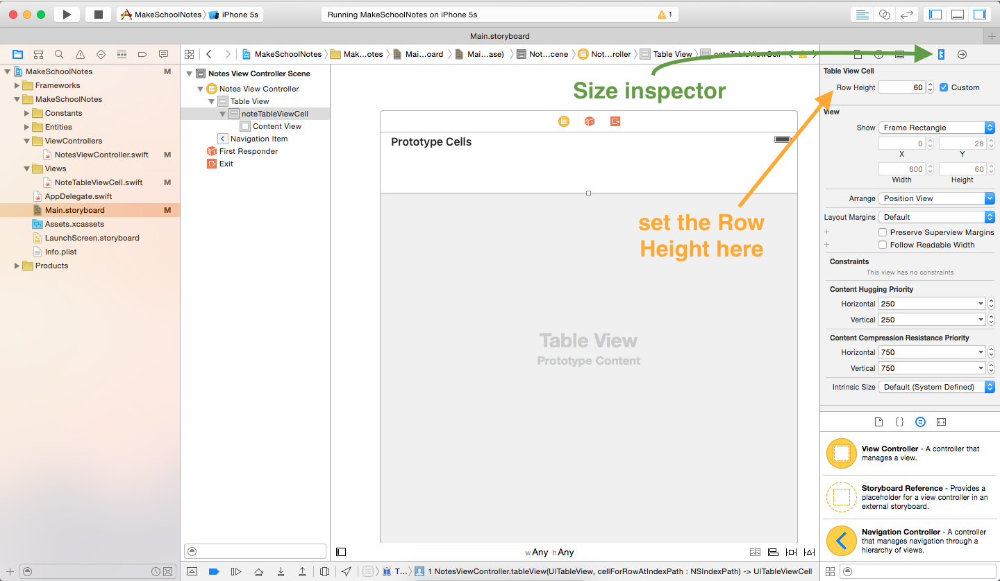
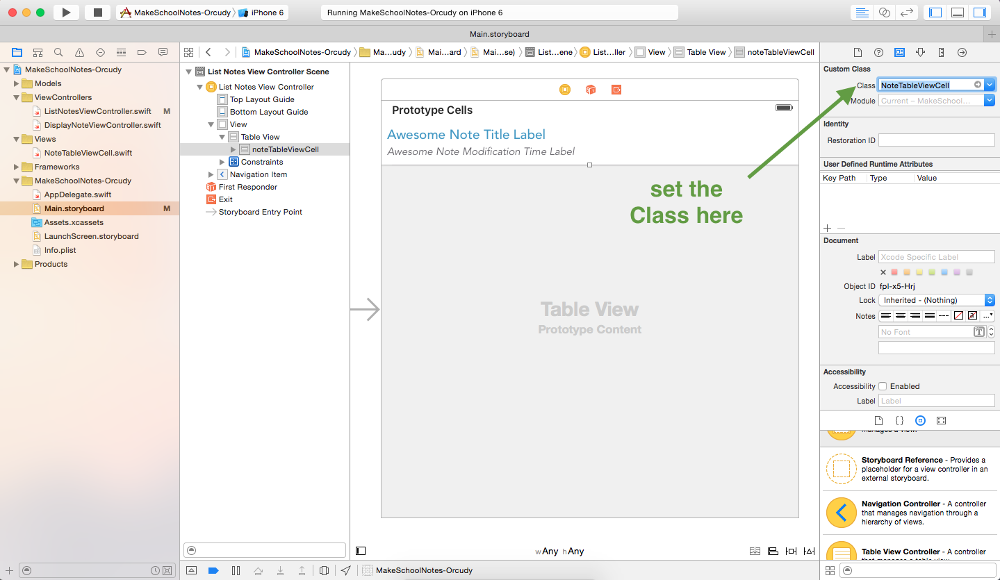
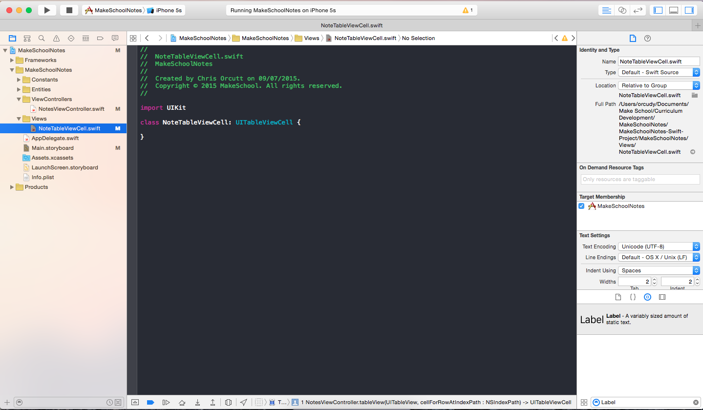
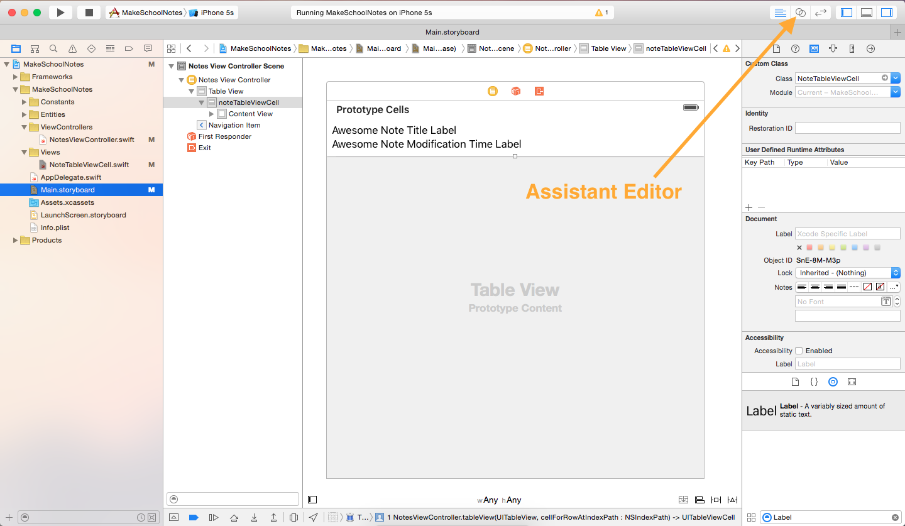
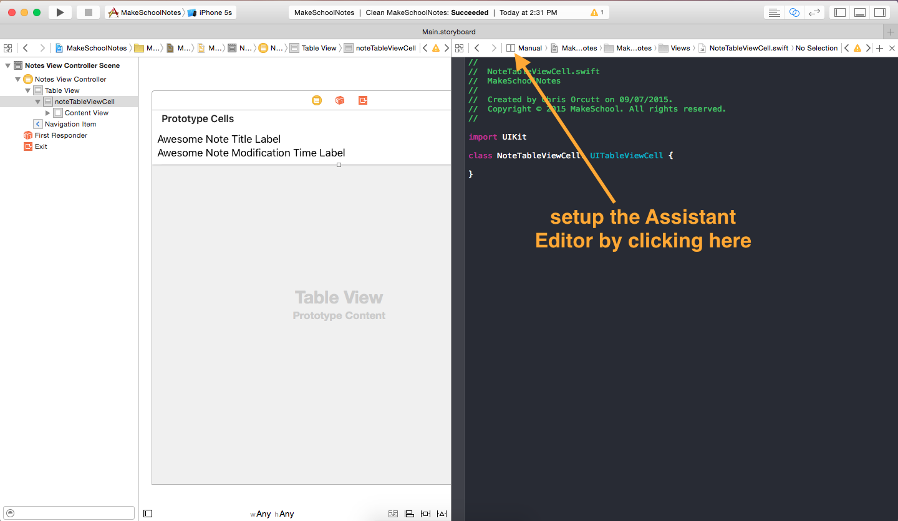
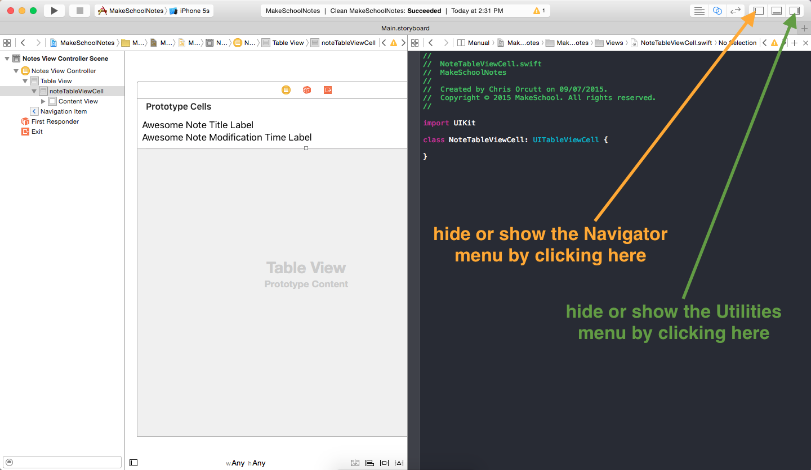
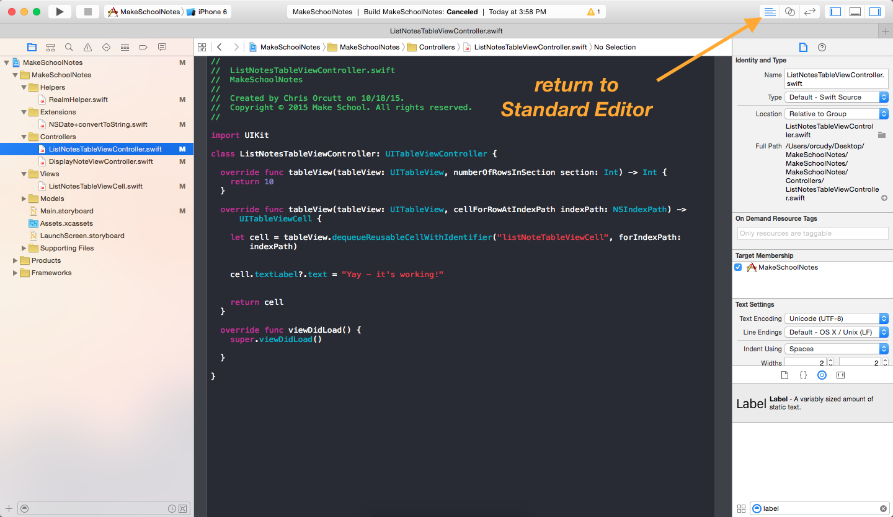
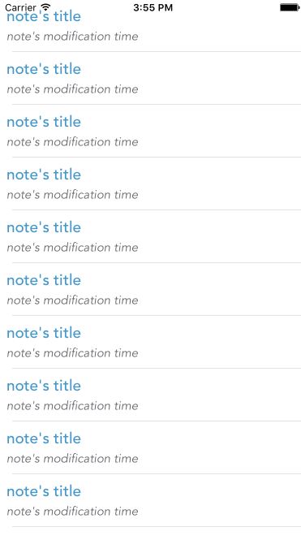

Now that we have our table view up and running, in this step, let's customize the table view cells so that we can display the note's title and modification time.

## Resizing our Cell

To display the note's title and modification time, we are going to need two labels. To ensure we have enough room for both of our labels, let's make the cell a little bit bigger.

> [action]
Select the *noteTableViewCell* in the *Document Outline*, click the *Size inspector* icon, and change the *Row Height* to 60:
>

Now let's change the hight of the table view to match.

> [action]
Select the *Table View* in the *Document Outline*, click the *Size inspector* icon, and change the row height to 60:

Notice that we had to change the row height for both our table view and our table view cell!

## Adding Labels to our Cell

Now that we have enough room, let's add our labels! (If you forgot how, revisit the [*Introduction to Interface Builder* -- BROKEN LINK](link to tutoral) tutorial.)

> [action]
Add two labels to our *noteTableViewCell*. Your cell should look something like this when finished:
>

## Customizing our Label's Text

Let's customize the look of our labels by changing the text size, font, and color. These attributes can be changed  in the Attributes inspector.

> [action] Select a label from the Document Outline, click the Attribute inspector icon, and experiment with changing the *Color* and *Font* fields. Your labels might look something like this afterwards:
>

Our cell is starting to come together, but we haven't finished yet! (If you try running your app now, you will see that things don't look quite right.)

## Connecting our Cell to Code

Because we want to be able to access our custom table view cell in code, we will need to set its custom class. We want to set the custom class of our table view cell (named *noteTableViewCell*) to the class named *NoteTableViewCell*. The *NoteTableViewCell* class was included in the starter project and can be found in the `NoteTableViewCell.swift` file within the *Views* folder in your Project navigator.

Notice the naming convention we are following: Our cell in Interface Builder is named "noteTableViewCell" (first letter is lowercase) and  we are connecting that cell to a class named "NoteTableViewCell" (first letter is uppercase). This convention is used heavily throughout iOS development.

> [action]
Select the *noteTableViewCell* in the *Document Outline*, click the *Identity inspector* icon, and set the *Class* field to "NoteTableViewCell":
>

Now that we have set the class of our *noteTableViewCell* to "NoteTableViewCell", let's take a look at the contents of the `NoteTableViewCell.swift` file.

> [action]
Click on the *Project navigator* icon, expand the *Views* folder, and select the `NoteTableViewCell.swift` file:
>

Although we set our custom class to enable us to programmatically alter our table view cell, we currently do not have any way to reference the labels we created in Interface Builder from the *NoteTableViewCell* class. To access the labels from this class, we must setup another type of connection called an `IBOutlet`.

## Introducing IBOutlets

`IBOutlets` are used to connect an object's properties in Interface Builder to properties in their respective classes. (The "IB" in "IBOutlet" stands for "Interface Builder".) In our case, we want to connect the two labels in our *noteTableViewCell* in Interface Builder, to two label properties in our *NoteTableViewCell* class.

When creating `IBOutlets` we will often use the *Assistant Editor*. The *Assistant Editor* provides us a way to simultaneously view our object in Interface Builder and its accompanying source file.

> [action]
Open the *Assistant Editor* as follows:
>
1. Click the *Assistant Editor* icon.
>
  
>
2. Setup the *Assistant Editor* by selecting: `Manual > MakeSchoolNotes > MakeSchoolNotes > Views > NoteTableViewCell.swift`
>
  
>
3. Hide the *Navigator* and *Utilities* menus.
>
  

With the *Assistant Editor* open, connecting our labels from Interface Builder to the *NoteTableViewCell* class is very easy: all we have to do is select the label and ***CTRL-click*** from the label to somewhere inside the *NoteTableViewCell* class definition.

> [action]
Add `IBOutlets` to the the *NoteTableViewCell* class as follows:
>
[./videos/add-iboutlets.mov video should be played here -- BROKEN LINK!]

We can now access the labels of our *noteTableViewCell* through the `noteTitle` and `noteModificationTime` instance properties of the *NoteTableViewCell* class! One last small change and then we will be ready to run our app!

## Typecasting our Cell to NoteTableViewCell

> [action]
Switch back to the *Standard Editor*, show the *Navigator* and *Utilities* menus, and select the `NotesViewController.swift` file.
>

Now that we are using a custom cell with type *NoteTableViewCell*, we must make some changes to our table view methods. Let's make the necessary changes and then discuss what changed afterwards.

> [action]
Replace the content of the `tableView(tableView: UITableView, cellForRowAtIndexPath indexPath: NSIndexPath) -> UITableViewCell` method with the following:
>
    // 1
    let cell = tableView.dequeueReusableCellWithIdentifier("noteTableViewCell", forIndexPath: indexPath) as! NoteTableViewCell
>    
    // 2
    cell.noteTitle.text = "note's title"
    cell.noteModificationTime.text = "note's modification time"
>    
    return cell

So what did we change in the code above?

1. In this line the only difference between our previous implementation is that we appended `as! NoteTableViewCell` to the end. This casts the return type of this method to *NoteTableViewCell*. This is necessary because we want the table view to display our custom *noteTableViewCell* which has type *NoteTableViewCell*.
2. Because `cell` now has type *NoteTableViewCell*, we can access the `noteTitle` and `noteModificationTime` instance properties.

## Running the App!

We have now finished making our custom table view cells and are ready to run the app! Your app should look similar to this:

Notice that the first cell is slightly hidden behind the *status bar*, let's fix that in the next tutorial!
