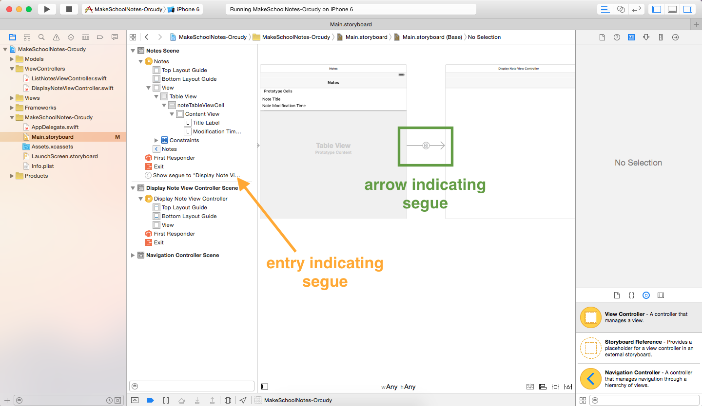

Now that we have a decent looking interface to list all of our notes, let's implement the functionality that will allow our users to tap a cell and view the contents of a note!

## Adding a New View Controller

For **Make School Notes**, when a user clicks on a note in the table view, we want to display the content of the note in a new screen. (Remember that in iOS, each view controller can display one screen.)

> [action] Add a *View Controller* from the Object library to your storyboard. Set the custom class of this view controller to *DisplayNoteViewController*.
>

## Introduction to Segues

To transition to new screens in iOS we use what are called *segues* (pronounced seg-way). For **Make School Notes**, when a user taps a table view cell we want to trigger a *segue* to our *Display Note View Controller Screen*. To set up this segue all we have to do is `CNTR-click` from our *listNotesTableViewCell* in our Document Outline to our *Display Note View Controller* in our storyboard.

> [action] `CNTL-click` from the *listNotesTableViewCell* to the *Display Note View Controller*, select *show* from underneath the *Selection Segue* options.
> 

Notice that when we added the segue an arrow appeared pointing from our *List Notes Table View Controller Screen* to our *Display Note View Controller Screen* and that a new segue entry appeared in our Document Outline. We can click either of the two to view the segue's attributes.

 

## Displaying and Editing Text

In our new *Display Note View Controller Screen*, we want to give our users the ability to view and optionally edit the title and content of their notes. In this case, using a label would not be sufficient because users cannot change the text of labels. Luckily there are two other objects that will give us this functionality: the *text field* and the *text view*.

The text field is best used when you want to capture a single line of text from the user, while the text view is best used when you want to capture multi-line text. In **Make School Notes** we will use a text field for our note's title and a text view for our note's content. Let's add one of each to our project now.

> [action]
Add a *Text Field* to the top of the *Display Note View Controller* and a *Text View* underneath. Resize your objects as necessary, they should look as follows:
>

Let's also ensure that our text field and text view will appear on screen correctly by using a feature of Auto Layout called "Reset to Suggested Constraints". As this point, you should not be worried about Auto Layout, this step is only to ensure these objects appear on screen correctly. We will go in-depth into Auto Layout in later tutorials.

> [action]
Select the *Display Note View Controller* from the Document Outline, then select `Editor > Resolve Auto Layout Issues > Reset to Suggested Constraints`.
>
 

## Running the App!

Now when we tap a table view cell we should transition to the *Display Note View Controller* screen! Also, note that the navigation controller we added earlier is providing the back button functionality and that if we click either of the text boxes, a keyboard shows up and we can begin editing, although our changes won't be saved just yet -- we'll add that functionality in a later tutorial. =]

